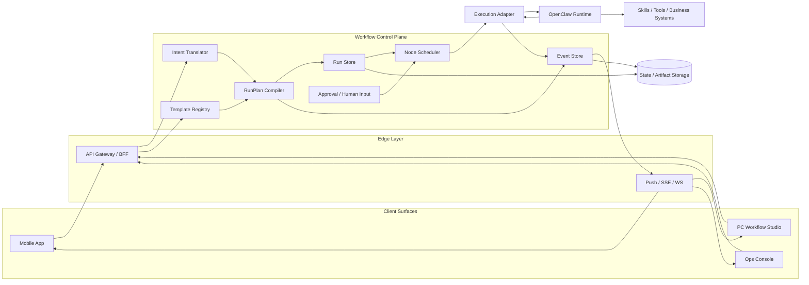
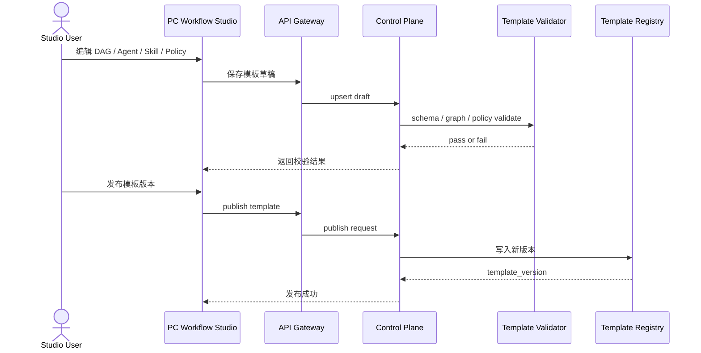
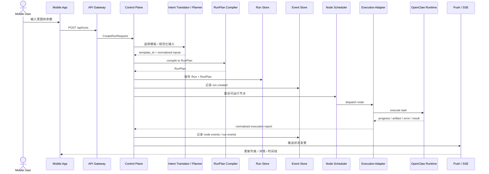
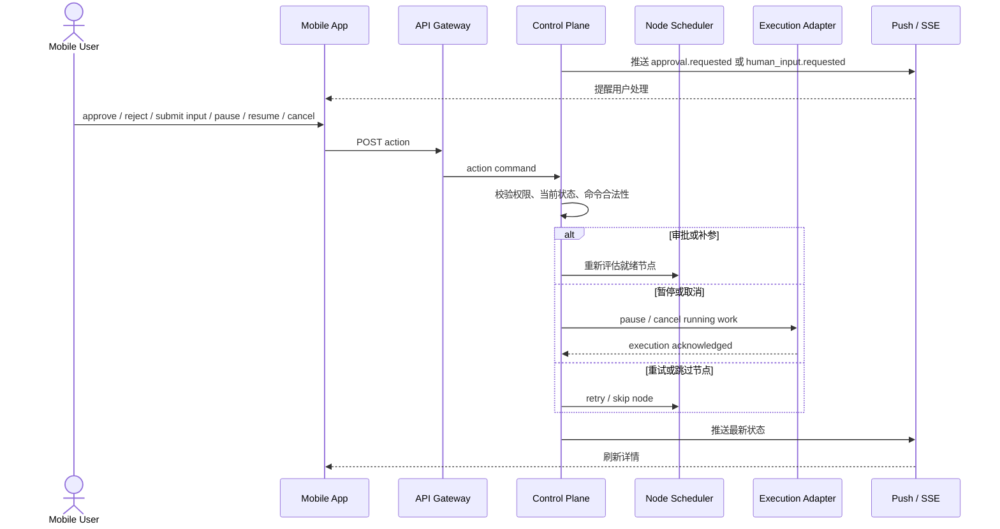
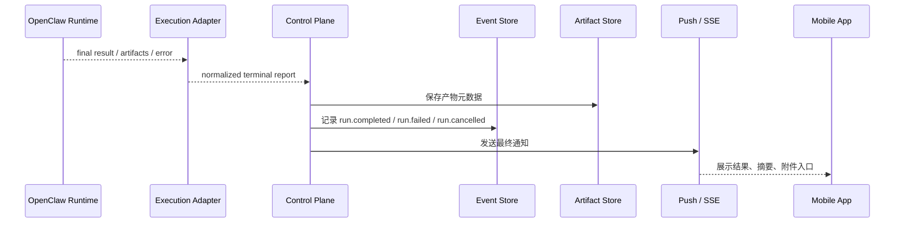
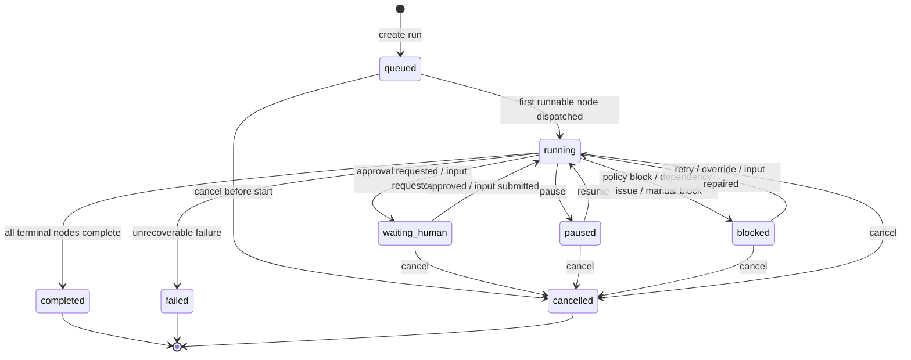
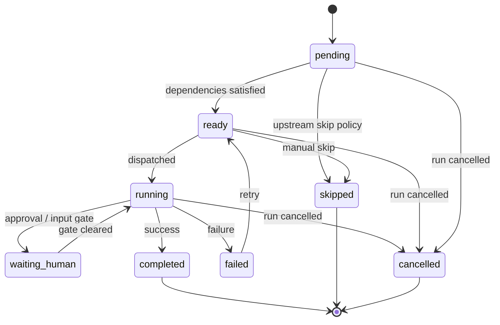

# My Mate 交互架构 / 时序图 / 状态流转

## 1. 文档目标

这份文档聚焦三个问题：

1. `Mobile / Studio / Control Plane / OpenClaw` 之间到底怎么交互
2. 哪一层拥有哪类状态的写权限
3. 一次完整 `Run` 从发起到结束如何流转

它不替代总体架构文档，而是补足运行时交互和状态治理视角。

## 2. 交互总览

### 2.1 两条主链路

`My Mate` 建议长期保持两条主链路分离：

- 配置链路：`PC Studio -> Gateway -> Control Plane`
- 运行链路：`Mobile -> Gateway -> Control Plane -> Execution Adapter -> OpenClaw`

配置链路解决“平台允许怎么跑”；运行链路解决“这次具体跑什么”。

### 2.2 四个交互平面

1. 配置平面
   - 模板、节点、边、Agent Profile、Skill Allowlist、Policy
   - 主要由 `Studio` 使用

2. 命令平面
   - create run、pause、resume、cancel、retry、approve、submit input
   - 主要由 `Mobile` 和运营后台使用

3. 事件平面
   - `run.created`、`node.started`、`approval.requested`、`run.completed`
   - 面向 `Mobile`、`Studio`、运营后台的只读订阅

4. 产物平面
   - 报告、补丁、摘要、附件、日志片段
   - 面向客户端展示和下载

### 2.3 总体交互图

## 3. 职责边界

### 3.1 组件职责表

| 组件 | 负责什么 | 可以发起什么 | 不应该做什么 |
| --- | --- | --- | --- |
| `Mobile App` | 发意图、看进度、审批、补参、暂停恢复取消 | Run 级和人工干预级命令 | 直接编辑 DAG、直接写 Run 状态、直接绑定 Skill |
| `PC Workflow Studio` | 配模板、配 Agent、配 Skill、发布版本 | 模板草稿和发布命令 | 直接改运行中 Run、直接派发 OpenClaw 任务 |
| `API Gateway / BFF` | 鉴权、聚合、面向端的接口适配 | 对 Control Plane 转发命令和查询 | 保存业务真相、做 DAG 编译 |
| `Control Plane` | 选模板、编译 RunPlan、维护 Run/Node 状态、事件、审批、调度 | 调度、状态转移、内部控制命令 | 直接暴露 OpenClaw 内部结构给客户端 |
| `Execution Adapter` | 把节点执行请求翻译成 OpenClaw 可执行任务，把报告标准化回传 | dispatch / pause / cancel 等执行命令 | 决定业务模板、直接改 Run 真相 |
| `OpenClaw Runtime` | 真正执行 agent、skill、tool、workspace 任务 | 子任务执行、进度报告、产物产出 | 决定最终 Run 状态机、绕过 Control Plane 写业务状态 |

### 3.2 Source of Truth

| 对象 | 真相归属 | 可写层 | 备注 |
| --- | --- | --- | --- |
| `WorkflowTemplate` | Control Plane / Template Registry | Studio 通过受控 API 写入 | 模板先校验再发布 |
| `RunPlan` | Control Plane / Compiler | 仅 Control Plane 生成 | 模板不能直接执行 |
| `Run State` | Control Plane / Run Store | 仅 Control Plane 修改 | 客户端只能发命令 |
| `Node Run State` | Control Plane / Scheduler | 仅 Control Plane 修改 | Adapter 只回传执行报告 |
| `Execution Raw Report` | Adapter / OpenClaw | Adapter 写入 | 原始执行事实，需要标准化 |
| `Artifact Metadata` | Control Plane | Control Plane 写元数据 | 二进制内容可在对象存储 |
| `Notification` | Event Store 派生视图 | 通知服务派生 | 通知不是系统真相 |

### 3.3 三条强约束

1. 客户端永远不直接改 `Run State`
2. `OpenClaw` 永远不直接决定业务层 `Run State`
3. 任何模板都必须先编译成 `RunPlan` 才能执行

## 4. 核心时序图

### 4.1 模板配置与发布

这里的关键点是：

- `Studio` 只管编辑和发布
- 模板真相在 `Control Plane`
- 发布前必须经过结构校验、能力校验、策略校验

### 4.2 手机发起一次 Run

这里最重要的边界是：

- `Mobile` 发送的是“意图”和“命令”，不是 DAG
- `Control Plane` 决定模板、计划和状态
- `OpenClaw` 只消费可执行节点任务

### 4.3 运行中人工干预

人工干预必须始终经过 `Control Plane`，不能直接打到 `OpenClaw`。

### 4.4 运行完成与收口

## 5. Run 生命周期

### 5.1 Run 状态流转图

### 5.2 Node Run 状态流转图

### 5.3 一次完整 Run 的阶段划分

可以把一次运行拆成 8 个阶段：

1. 意图进入
   - `Mobile` 提交用户意图

2. 模板选择
   - `Control Plane` 选择模板，或让 Planner 提议模板

3. 计划编译
   - `WorkflowTemplate -> RunPlan`

4. 持久化
   - 保存 `Run`、`RunPlan`、首条事件

5. 前沿调度
   - 找到当前可运行节点集合

6. 执行回传
   - `OpenClaw` 执行，`Adapter` 标准化报告

7. 人工干预
   - 审批、补参、暂停、恢复、重试、跳过

8. 收口归档
   - 终态写入、摘要生成、产物展示、通知下发

## 6. 接口边界建议

### 6.1 Mobile 对外接口

移动端建议只暴露 Run 级和干预级接口：

- `POST /api/runs`
- `GET /api/runs`
- `GET /api/runs/{runId}`
- `GET /api/runs/{runId}/events`
- `GET /api/runs/{runId}/artifacts`
- `POST /api/runs/{runId}/actions/pause`
- `POST /api/runs/{runId}/actions/resume`
- `POST /api/runs/{runId}/actions/cancel`
- `POST /api/runs/{runId}/nodes/{nodeRunId}/actions/retry`
- `POST /api/runs/{runId}/nodes/{nodeRunId}/actions/skip`

后续建议再补两类接口：

- 审批接口
- 人工补参接口

移动端不应该有：

- 模板编辑接口
- 节点依赖编辑接口
- Skill 绑定接口

### 6.2 Studio 对外接口

Studio 面向设计时能力：

- 模板草稿 CRUD
- 模板校验
- 模板发布
- Agent Profile 管理
- Skill Catalog 查询
- 模板模拟 / 预览

Studio 不应该直接拥有：

- Run 状态修改权
- 运行时节点派发权

### 6.3 Control Plane 与 Adapter 内部边界

`Control Plane -> Adapter` 发送的应该是“节点执行信封”，至少包含：

- `run_id`
- `node_run_id`
- `template_id`
- `agent_profile`
- `skills_allowlist`
- `node_inputs`
- `timeout_policy`
- `retry_policy`
- `budget_limits`
- `trace_context`

`Adapter -> Control Plane` 回传的应该是“标准化执行报告”，至少包含：

- `run_id`
- `node_run_id`
- `execution_status`
- `progress_message`
- `artifacts`
- `error_code`
- `error_message`
- `openclaw_session_id`
- `started_at`
- `finished_at`

### 6.4 Adapter 与 OpenClaw 的边界

Adapter 对 `OpenClaw` 说的是执行语言，不是产品语言。

也就是：

- 对外叫 `Run / Node / Approval / Artifact`
- 对内落到 `task / session / agent / skill / tool`

这层的意义是把产品语义和运行时语义隔开，避免以后被 `OpenClaw` 内部实现反向绑死。

当前项目的落地策略是：

- `Execution Adapter` 先抽成稳定接口
- 默认使用 `LocalExecutionAdapter` 跑本地闭环
- `OpenClawExecutionAdapter` 先保留骨架
- 等内部 dispatch / report 契约稳定后，再替换为真实 `OpenClaw` 接入

## 7. 关键设计结论

1. `Mobile` 是意图入口和人工干预入口，不是工作流编辑器
2. `Studio` 是模板和策略配置端，不是执行端
3. `Control Plane` 是唯一 Run 真相拥有者
4. `OpenClaw` 是执行内核，不是业务状态机
5. `RunPlan` 才是执行真相，模板只是编译输入
6. 动态 DAG 只能发生在模板约束和策略护栏之内

## 8. 推荐落地顺序

如果沿当前项目继续推进，建议紧接着实现：

1. `GET /api/runs/{runId}/events`
2. `Event Store` 与基础时间线模型
3. `Template Registry` 骨架
4. `RunPlan Compiler` 骨架
5. `Execution Adapter` 内部契约

这样做的好处是，交互架构、状态机、模板系统、OpenClaw 集成会自然对齐，不会先把客户端或执行层做偏。
