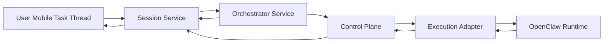

# OpenClaw Conversation Product Implementation

This document remains useful for the OpenClaw responsibility split and the
Session/OpenClaw boundary.

The newer alignment in
[`docs/13-dual-video-product-alignment.md`](/C:/project/my-mate/docs/13-dual-video-product-alignment.md)
updates one important product point:

- `Session` should no longer be treated as the final top-level product object
- the exposed product should evolve toward a `Mission` workspace above Session

This document explains how to turn the current My Mate + OpenClaw integration into a product closer to the reference conversation-first agent experience.

It builds on:

- [`docs/09-conversation-first-orchestrator-redesign.md`](/C:/project/my-mate/docs/09-conversation-first-orchestrator-redesign.md)
- [`docs/10-bilibili-reference-video-review.md`](/C:/project/my-mate/docs/10-bilibili-reference-video-review.md)

## Short Answer

Yes, the current repository can evolve into a similar product with OpenClaw.

The key is to keep OpenClaw in the execution layer and build a new orchestration layer above it:

- **My Mate Session Layer** for conversation and user-facing task flow
- **My Mate Orchestrator Layer** for planning, replanning, and DAG mutation
- **My Mate Control Plane** for run / node / event truth
- **OpenClaw** for actual agent runtime execution

The main rule is:

- do not let OpenClaw become the user-facing product shell
- do not let `Run` remain the primary user-facing object

## What OpenClaw Already Gives You

From the current integration code and adapter boundary, OpenClaw already provides useful runtime capabilities:

- isolated agent execution
- skills and tool use
- task registration and task polling
- final trajectory export
- final agent report extraction
- async execution recovery
- callback-based normalized status return

That means OpenClaw is already good enough to act as:

- node executor
- branch executor
- artifact producer
- report emitter

This is an important point:

you do **not** need OpenClaw itself to become the orchestrator product UI.

## What OpenClaw Should Not Own

OpenClaw should not become the source of truth for:

- conversation sessions
- user-visible planning state
- final business DAG
- approvals policy
- human-input workflow
- user intervention semantics
- cross-node orchestration strategy

Those must stay in My Mate.

Otherwise the product becomes:

- hard to explain
- hard to patch dynamically
- too coupled to internal runtime assumptions

## Correct Responsibility Split

### My Mate Session Layer

Owns:

- user message thread
- orchestrator replies
- plan proposals
- intervention requests
- artifact presentation
- session summary

Primary object:

- `Session`

### My Mate Orchestrator Layer

Owns:

- task understanding
- task decomposition
- template reuse vs DAG synthesis choice
- registry-aware agent and skill selection
- approval placement
- replan decisions
- DAG patch generation

Primary objects:

- `PlanDraft`
- `PlanRevision`
- `DagPatch`

### My Mate Control Plane

Owns:

- `Run`
- `RunPlan`
- compiled nodes
- scheduling state
- event stream
- approvals and human inputs
- artifacts index

### OpenClaw

Owns:

- node execution
- tools / skills execution
- local workspace work
- direct-agent output
- trajectory and raw execution traces

## What The Product Flow Should Become

### 1. User starts a Session

Instead of `Create Run`, the user creates:

- `New Task`

Example:

> 帮我做一个小红书图，基于这个新闻，语气偏真实博主，不要太像广告。

The Session stores:

- user goal
- attachments
- message history
- current orchestrator state

No real `Run` has to exist yet.

### 2. Orchestrator replies in natural language

The orchestrator should:

- restate the task
- ask missing questions
- propose a first plan

At this stage, the orchestrator may call:

- template recommendation
- DAG draft generation
- registry recommendation

But the user sees:

- a message
- a plan card

not:

- raw planner endpoint output

### 3. Orchestrator creates or revises a DAG

After enough context, the orchestrator chooses one of three modes:

1. reuse existing template
2. derive from template
3. synthesize fresh DAG

The important shift is:

the orchestrator owns the choice, not the user.

The user can still inspect or confirm it, but does not have to configure it manually.

### 4. Control plane materializes a Run

Only after confirmation does the Session create:

- one `Run`
- one `RunPlan`
- compiled node set

That means:

- `Session` is the product shell
- `Run` is the executable instance

This is the missing distinction in the current product.

### 5. Nodes dispatch into OpenClaw

This part is already largely in place.

Current chain:

- `DispatchEnvelope`
- `OpenClawBridgeDispatchRequest`
- execution adapter dispatch
- OpenClaw direct-agent execution
- callback report

That should remain.

### 6. OpenClaw reports are translated into Session events

Today, OpenClaw reports become:

- run status updates
- node progress
- artifacts
- waiting human gates

Next, they also need to become:

- orchestrator messages
- subtask cards
- inline output updates
- “what changed” summaries

This is where the product feeling changes dramatically without replacing the runtime.

## The Most Important New Object: Session

Add a first-class `SessionRecord`.

Suggested fields:

- `session_id`
- `title`
- `status`
- `created_by`
- `created_at`
- `updated_at`
- `current_goal`
- `current_plan_summary`
- `latest_run_id`
- `active_run_ids`
- `last_orchestrator_message_id`
- `metadata`

Then add `SessionMessageRecord`.

Suggested fields:

- `message_id`
- `session_id`
- `role`:
  - `user`
  - `orchestrator`
  - `system`
- `kind`:
  - `text`
  - `plan_card`
  - `approval_card`
  - `artifact_card`
  - `subtask_card`
  - `dag_patch_card`
  - `result_card`
- `content`
- `created_at`
- `linked_run_id`
- `linked_node_run_id`

This lets the mobile app become a thread instead of three disconnected pages.

## How OpenClaw Fits Into Session-Based UX

OpenClaw should be treated as a worker that produces structured execution updates.

### Current callback payload

You already normalize:

- `accepted`
- `running`
- `waiting_human`
- `completed`
- `failed`
- `cancelled`

That is good.

### Next translation layer

Add a translation step from execution report to session-facing messages.

Examples:

- `accepted` -> “我已经开始安排这个步骤”
- `running` -> “正在处理：提炼新闻角度”
- `waiting_human` -> “我需要你确认用哪个方向”
- `completed` with artifact -> “第一版文案已经出来了”
- `failed` -> “这个步骤没跑通，我准备换一种方式重试”

The user should not have to interpret low-level adapter status directly.

## How To Use OpenClaw For Multi-Step Product Experience

There are two viable patterns.

### Pattern A: OpenClaw executes individual nodes only

My Mate orchestrator:

- decomposes task
- creates DAG
- decides runtime changes

OpenClaw:

- executes each node
- returns reports and artifacts

This is the cleanest design for your current repo.

### Pattern B: one OpenClaw task acts as a sub-orchestrated worker

For some nodes, My Mate can dispatch a larger task bundle to OpenClaw and let OpenClaw internally coordinate a mini-flow.

Use this only when:

- the unit of work is cohesive
- you do not need fine-grained user intervention inside it

Examples:

- generate a single asset package
- run a focused research pass
- produce a draft deliverable

Do not use this as the default for the entire user experience, or My Mate loses the visible middle layer.

## Recommended Product Architecture With OpenClaw

Interpretation:

- user talks to Session
- Session asks Orchestrator to think
- Orchestrator asks Control Plane to run work
- Control Plane asks OpenClaw to execute nodes
- execution updates come back upward
- Session turns them into a coherent task conversation

## What To Build First

### Phase 1: Session shell around the existing Run system

Implement:

- `SessionRecord`
- `SessionMessageRecord`
- `POST /api/sessions`
- `POST /api/sessions/:sessionId/messages`
- `GET /api/sessions/:sessionId`
- `GET /api/sessions/:sessionId/messages`

At this stage:

- Orchestrator can still call the current planner endpoints
- Run creation still uses the current control-plane path
- OpenClaw integration stays unchanged

This delivers immediate product value without destabilizing runtime.

### Phase 2: Session-aware planner output

Implement:

- plan proposal cards
- DAG draft cards
- registry warning cards
- confirmation cards before creating a run

This directly addresses the current “form shell” problem.

### Phase 3: Session event projection from OpenClaw reports

When control-plane receives node reports, also project them into Session messages:

- progress cards
- output cards
- blocker cards
- approval cards

This is the step where the app starts feeling alive.

### Phase 4: Runtime DAG patching

Implement control-plane patch operations:

- `add_node`
- `skip_node`
- `replace_agent_binding`
- `change_parallelism`
- `pause_for_replan`
- `resume_with_patch`

Then let orchestrator map natural-language user interventions into those patches.

This is the step that makes the system genuinely dynamic.

## How To Represent Dynamic Changes

When the user says:

- “先别出图，先给我看文案”

The orchestrator should not directly hack OpenClaw.

It should:

1. interpret intent
2. emit a `DagPatch`
3. apply patch in control-plane
4. reschedule affected nodes
5. dispatch resulting nodes to OpenClaw
6. publish a Session message explaining the change

This preserves architecture clarity.

## What OpenClaw Report Extraction Should Do Next

The current bridge already extracts:

- handoff
- agent report
- trajectory

Extend it to derive more structured execution semantics, for example:

- summary
- suggested next action
- requires_human_confirmation
- comparison candidates
- files changed

Then the Session layer can present richer cards without scraping raw text each time.

## Key Constraint To Respect

Do not force the My Mate product to mirror OpenClaw’s internal runtime model 1:1.

Use OpenClaw as:

- execution substrate
- artifact generator
- trace source

But keep:

- product grammar
- session grammar
- orchestration grammar

inside My Mate.

That separation is what lets you build a better product than a raw runtime console.

## Immediate Build Recommendation

The next concrete implementation order should be:

1. add Session data model and file store
2. add Session APIs
3. add mobile task thread page
4. project planner output into Session messages
5. link created Runs back into Session
6. project OpenClaw execution reports into Session messages

Only after that should you spend a larger cycle on:

- LLM orchestrator planner
- runtime DAG mutation
- richer real-time product presence

## Practical Bottom Line

You do not need to replace OpenClaw.

You need to:

- wrap it in a better product architecture
- move the user-facing object from `Run` to `Session`
- move the user-facing interaction from `form + status page` to `conversation + visible work progression`

That is the shortest path from the current repository to something much closer to the reference demo.
