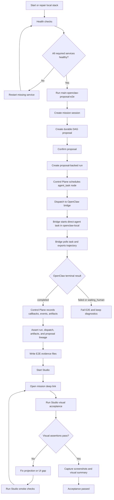

# OpenClaw End-To-End Flow

This document records the current My Mate -> OpenClaw integration path as an
operational flow, not only an architecture sketch.

The verified topology is:

```text
Studio / Mobile
  -> API Gateway :4030
  -> Control Plane :4010
  -> Execution Adapter / OpenClaw Bridge :4020
  -> openclaw-local container
  -> Control Plane callbacks
  -> Mission workspace projections
```

## Runtime Boundary

My Mate owns:

- mission/session state
- MissionSpec and proposal identity
- run and node lifecycle truth
- approval, human input, intervention, and patch records
- artifact records and workspace projection

OpenClaw owns:

- the actual agent execution substrate
- the container-side task/session runtime
- direct-agent task execution and trajectory generation

The Execution Adapter is the translation and recovery boundary between them.
Clients should not call OpenClaw directly for business-state mutation.

## Service Topology

Current main-stack local ports:

| Service | Port | Role |
|---|---:|---|
| Studio | 5174 | Desktop mission workspace and orchestration UI |
| API Gateway | 4030 | Client-facing BFF/proxy |
| Control Plane | 4010 | Workflow, run, node, session, proposal, and callback truth |
| Execution Adapter | 4020 | OpenClaw bridge API |
| openclaw-local gateway | 18789 | Container-side OpenClaw gateway |
| openclaw-local approval console | 4315 | Container-side approval console |
| openclaw-local web console | 7681 | Container-side web console |

The main OpenClaw stack expects:

```text
MY_MATE_EXECUTION_ADAPTER=openclaw
MY_MATE_OPENCLAW_BRIDGE_BASE_URL=http://127.0.0.1:4020
MY_MATE_OPENCLAW_BRIDGE_EXECUTION_MODE=container-exec
MY_MATE_OPENCLAW_CONTAINER_NAME=openclaw-local
MY_MATE_OPENCLAW_CONTAINER_EXECUTION_STRATEGY=direct-agent
```

## Business Flow

### 1. Mission/session intake

The user starts from Studio or Mobile and creates or opens a mission-backed
session through the Gateway:

```text
POST /api/sessions
```

The Control Plane persists the session and records the conversation/workspace
state.

### 2. Durable DAG proposal

Studio creates a durable proposal for the selected session:

```text
POST /api/sessions/:sessionId/dag-proposals
```

The proposal captures:

- proposal identity
- MissionSpec contract snapshot
- route/source metadata
- planner context
- subagent assignments
- execution template and DAG draft

This is the durable planning object that bridges mission planning into
execution.

### 3. Human confirmation

The user confirms the proposal:

```text
POST /api/sessions/:sessionId/dag-proposals/:proposalId/confirm
```

The Control Plane sets `session.confirmed_proposal_id` and keeps proposal
lineage visible to Studio and Mobile.

### 4. Proposal-backed run creation

The user launches a run from the confirmed proposal:

```text
POST /api/sessions/:sessionId/runs
body: { "proposal_id": "...", "validation_mode": "strict", "inputs": {...} }
```

The Control Plane resolves execution source in this order:

1. explicit `proposal_id`
2. session `confirmed_proposal_id`
3. explicit `plan_revision` and `plan_option`
4. session confirmed revision/option
5. legacy latest-plan fallback

The created `RunRecord` stores `proposal_id` as first-class lineage.

### 5. Control Plane scheduling

The Control Plane compiles the run plan into runtime nodes and schedules ready
nodes.

For an `agent_task` node with an OpenClaw-backed agent assignment, it dispatches
through the OpenClaw adapter instead of the local execution engine.

### 6. Dispatch to OpenClaw bridge

The Control Plane calls the Execution Adapter:

```text
POST /api/v1/dispatches
```

In `container-exec` + `direct-agent` mode, the bridge:

1. accepts the dispatch
2. sends `accepted` callback to the Control Plane
3. materializes a requirement bundle
4. copies it into the `openclaw-local` runtime volume
5. runs container-side task registration
6. starts an isolated OpenClaw direct-agent task with detached `docker exec -d`
7. stores `openclaw_task_id`, `openclaw_result_run_id`, and session keys
8. sends `running` callback to the Control Plane

### 7. Async OpenClaw completion

The bridge background poller:

- queries container-side task state
- falls back to tolerant task-list parsing when needed
- exports trajectory when the task reaches a terminal state
- extracts the final agent report
- maps OpenClaw outcome into My Mate callback status:
  - `completed`
  - `failed`
  - `waiting_human`

It then sends completion callbacks and artifact metadata to the Control Plane.

### 8. Control Plane callback projection

The Control Plane records:

- run events
- node status changes
- artifact records
- run summary
- mission/session workspace state

Returned artifacts are projected back into:

- run artifact APIs
- session thread evidence
- mission workspace outputs
- Studio right rail / Workspace Feed
- runtime graph and delivery trace surfaces

### 9. Studio verification surface

Studio reads back the same truth through its own API surface:

```text
GET /api/sessions/:sessionId
GET /api/runs/:runId/graph
GET /api/runs/:runId/artifacts
GET /api/sessions/:sessionId/compare
GET /api/sessions/:sessionId/dag-proposals/:proposalId
```

This confirms that the OpenClaw result is not only completed in the bridge, but
also visible in the Mission workspace projection.

## E2E Verification Flow

The full acceptance pass validates both execution truth and Studio projection.
The E2E script proves that OpenClaw can complete a proposal-backed run; the
visual pass proves that the same run is understandable from the Mission
workspace.



Acceptance criteria:

- service health: Gateway, Control Plane, Execution Adapter, and
  `openclaw-local` are reachable
- proposal lineage: session, proposal, confirmed proposal, run, and dispatch ids
  remain linked
- execution result: run and dispatch reach `completed`
- artifact projection: OpenClaw outputs are recorded as artifacts and returned
  outputs
- Studio projection: Mission Workspace shows proposal trace, runtime graph,
  mission inspector, workspace feed, and returned outputs
- evidence: JSON summaries and screenshots are written under `tmp/`

## Operational Commands

Start or repair the main OpenClaw Control Plane path:

```powershell
node scripts\start-main-openclaw.mjs --control-plane
```

Start both bridge and Control Plane if needed:

```powershell
node scripts\start-main-openclaw.mjs --all
```

Run the main proposal-confirm-run regression:

```powershell
node scripts\main-openclaw-proposal-e2e.mjs
```

Run the Studio projection visual acceptance against the latest E2E summary:

```powershell
cd apps\studio
npm run visual:openclaw
```

Run the combined OpenClaw + Studio acceptance orchestrator:

```powershell
node scripts\main-openclaw-studio-acceptance.mjs
```

The combined command:

1. starts or reuses the main OpenClaw bridge and Control Plane
2. verifies API Gateway health on `http://127.0.0.1:4030/health`
3. starts or reuses Studio on `http://127.0.0.1:5174`
4. runs `scripts/main-openclaw-proposal-e2e.mjs`
5. runs Studio OpenClaw visual acceptance using the generated `summary.json`
6. writes combined evidence under `tmp/main-openclaw-studio-acceptance/`

The visual pass requires Chrome CDP on port `9223` by default. Override with
`CHROME_CDP_PORT` or `--cdp-port`.

Expected health:

```text
GET http://127.0.0.1:4010/health -> {"status":"ok"}
GET http://127.0.0.1:4020/health -> {"status":"ok","mode":"container-exec","port":4020}
GET http://127.0.0.1:4030/api/runtime/summary
  execution_runtime.adapter_kind = "openclaw"
  execution_runtime.bridge_execution_mode = "container-exec"
```

## Latest Verification

Verified on 2026-07-04 with:

```powershell
node scripts\main-openclaw-proposal-e2e.mjs
```

Result:

```text
session_id  = sess_20260704T141208363Z_000_qc6ted
proposal_id = prop_20260704T141208531Z_000_tobao3
run_id      = run_20260704T141208674Z_000_u99oi2
dispatch_id = disp_20260704T141208845Z_000_gpqtwg

run.status      = completed
artifact_count  = 2
event_count     = 11
dispatch.status = completed
dispatch.mode   = container-exec

openclaw_task_id       = 96e262a3-50d3-4f4c-b5ac-46a4e461aa57
openclaw_result_run_id = 6d3baaf3-dd0c-4c05-ae5a-c6f824d3e988
```

Evidence files:

```text
tmp/main-openclaw-proposal-e2e/20260704T141208302Z/summary.json
tmp/main-openclaw-proposal-e2e/20260704T141208302Z/observations.json
```

Studio visual acceptance was also verified with the formal acceptance
orchestrator:

```powershell
node scripts\main-openclaw-studio-acceptance.mjs --skip-stack-start --skip-e2e --summary tmp\main-openclaw-proposal-e2e\20260704T141208302Z\summary.json
```

Visual evidence files:

```text
tmp/main-openclaw-studio-acceptance/20260704T153213819Z/summary.json
tmp/main-openclaw-studio-acceptance/20260704T153213819Z/studio-visual/visual-summary.json
tmp/main-openclaw-studio-acceptance/20260704T153213819Z/studio-visual/studio-openclaw-session.png
tmp/main-openclaw-studio-acceptance/20260704T153213819Z/studio-visual/studio-openclaw-proposal-trace.png
tmp/main-openclaw-studio-acceptance/20260704T153213819Z/studio-visual/studio-openclaw-runtime-graph.png
```

The observed run progression was:

```text
Dispatching node: Backend Task
-> Dispatching to OpenClaw bridge
-> OpenClaw direct-agent task started in Docker runtime
-> async polling
-> run completed
-> 2 artifacts returned
```

## Current Limits

The current bridge is intentionally a compatibility bridge over the existing
Dockerized OpenClaw runtime.

Known limits:

- `direct-agent` currently runs isolated OpenClaw agent tasks; it does not yet
  rejoin the original architect-controlled multi-stage OpenClaw session graph.
- The bridge polls container task state asynchronously rather than receiving a
  native OpenClaw event stream.
- Startup recovery and sweep are implemented, but the ops UI does not yet show
  detailed per-dispatch maintenance operations.
- Runtime patching is represented and applied in My Mate Control Plane, then
  adapter notification is used where relevant; full visual OpenClaw graph
  editing is still a later Studio graph workbench slice.

## Next Hardening Direction

The next useful hardening work is:

1. keep the main E2E script as the release gate for OpenClaw integration
2. keep the Studio visual acceptance pass wired into the OpenClaw release gate
3. expose dispatch recovery/sweep details in an operator-facing surface
4. add broader dynamic natural-language steering mappings
5. decide whether deeper OpenClaw architect-session rejoin is needed, or whether
   the current direct-agent bridge remains the correct production boundary
