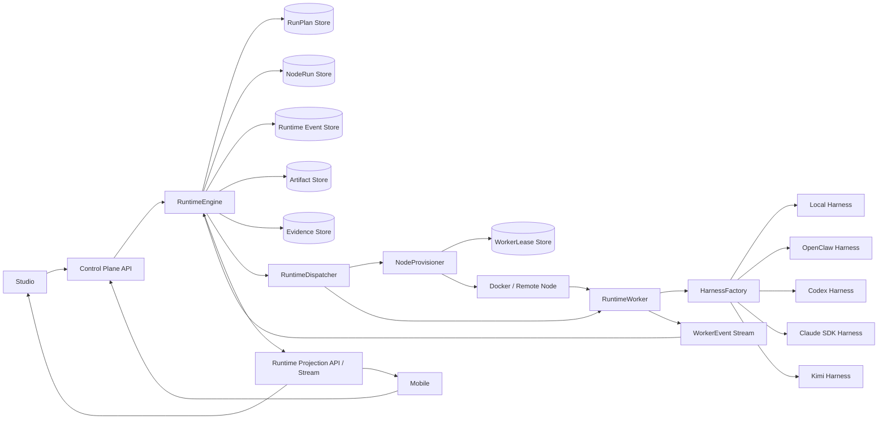
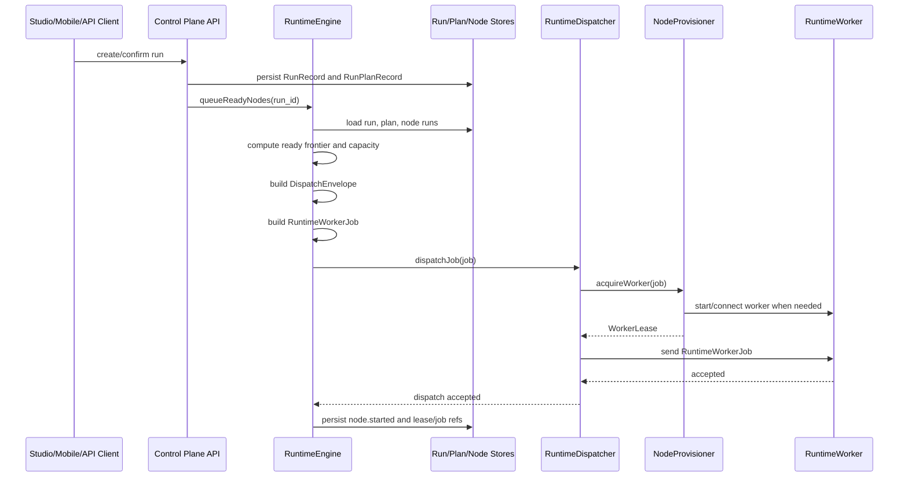
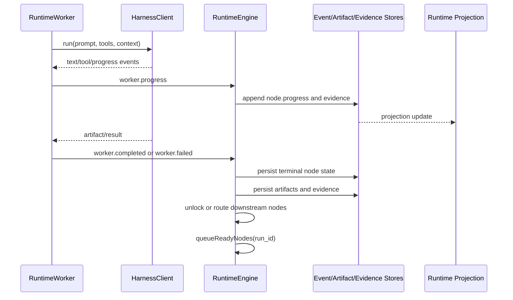
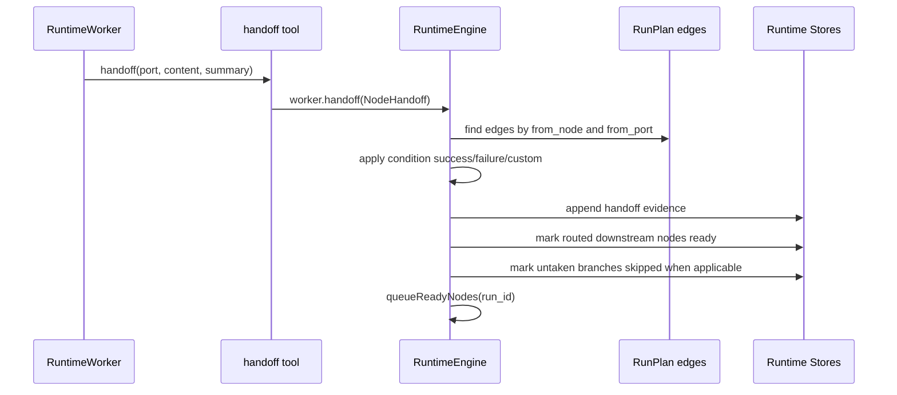
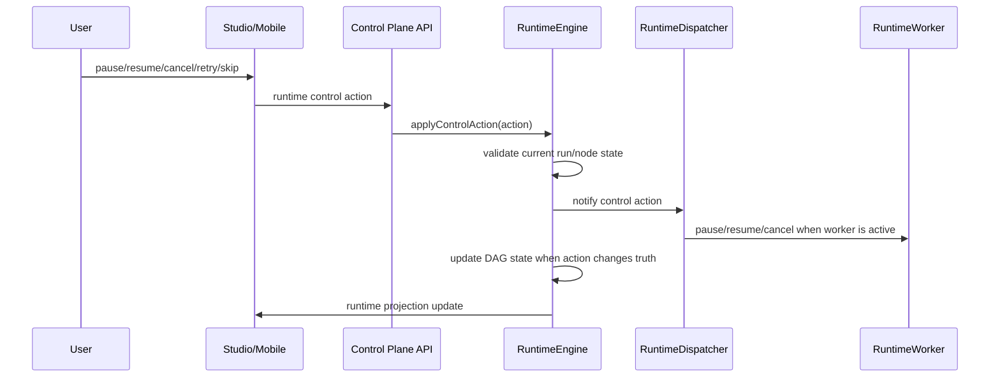
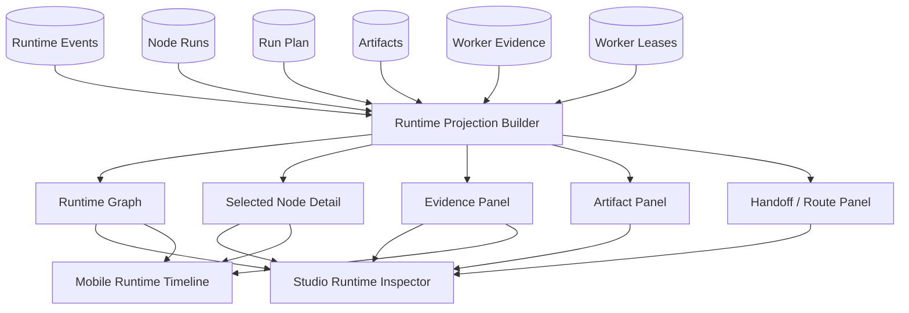

# HomeRail-like Runtime Architecture Direction

This document supersedes the narrow "My Mate above OpenClaw" framing.

The product goal is closer to a HomeRail-like system: a manager-owned DAG
runtime where agent execution is auditable, resumable, and backed by pluggable
agent harnesses.

OpenClaw should remain useful, but it should no longer be a product semantic in
My Mate. It should be one runtime harness behind the My Mate runtime protocol.

## HomeRail Implementation Pattern

The useful HomeRail pattern is not the UI or the exact backend list. The key
architecture is the split between manager state, dispatch protocol, worker
execution, and backend agent clients.

Reviewed local reference: `C:\tmp\homerail`.

Important implementation points:

- `homerail_manager/src/orchestration/dag-engine.ts`
  - owns DAG run state
  - tracks ready/running/terminal node state
  - decides when a node can start
  - accepts handoff events back into the active run
- `homerail_manager/src/orchestration/dag-dispatcher.ts`
  - defines a stable `DispatchEnvelope`
  - keeps manager dispatch independent from the worker implementation
- `homerail_manager/src/orchestration/ws-dispatch-adapter.ts`
  - provisions/targets workers
  - injects the selected `AGENT_BACKEND`
  - does not make the manager become Claude, Codex, Kimi, or any other agent
    runtime
- `homerail_worker/src/agent/types.ts`
  - defines a small `AgentClient.run(...)` interface
  - backends emit normalized events instead of leaking provider-specific state
    into manager logic
- `homerail_worker/src/agent/factory.ts`
  - selects `claude-sdk`, `codex_appserver`, `kimi_code`, or deterministic
    clients through a registry
  - allows runtime registration of custom backends

The important design lesson:

```text
Manager DAG semantics
  -> Dispatch envelope
  -> Worker runtime
  -> Agent backend factory
  -> Claude / Codex / Kimi / deterministic / custom
```

The manager does not know that "Claude" is the product. It only knows a node is
ready and sends a node execution envelope to a runtime boundary.

## My Mate Target Split

My Mate should adopt the same shape, with product terms preserved at the top
and harness terms pushed down.

```text
My Mate product layer
  - Mission Workspace
  - Session thread
  - planning, approvals, interventions
  - route comparison and runtime graph

My Mate manager / control plane
  - RunPlan
  - compiled nodes
  - frontier and node state
  - normalized events and artifacts

My Mate runtime protocol
  - DispatchEnvelope
  - RuntimeWorkerJob
  - WorkerEvent
  - NodeHandoff
  - WorkerLease
  - WorkerProvisionRequest
  - NormalizedExecutionReport
  - control actions: pause / resume / cancel / retry / skip

Worker / adapter layer
  - openclaw harness
  - local deterministic harness
  - future codex harness
  - future claude-sdk harness
  - future kimi harness
```

The product should talk about `runtime_agent_ref`, `agent_runtime`, and
`harness_profile`.

Only the OpenClaw adapter should talk about `openclaw_agent_id`,
`openclaw_task_id`, or OpenClaw bridge payloads.

## Backend Runtime Mapping

The backend should match HomeRail at the runtime seam, not by copying every
module name.

Current My Mate responsibilities:

```text
run-plan-compiler.ts
  -> compiles WorkflowTemplate into RunPlanRecord.compiled_nodes

node-scheduler.ts
  -> computes ready frontier and applies node status transitions

app.ts queueReadyNodes(...)
  -> starts ready nodes
  -> builds DispatchEnvelope
  -> calls ExecutionAdapter.dispatchNode(...)
  -> persists node.started / node.progress / node.completed events

ExecutionAdapter
  -> local in-process executor, or OpenClaw bridge adapter

services/execution-adapter
  -> OpenClaw-specific bridge
  -> can prepare native/container OpenClaw execution
  -> posts NormalizedExecutionReport callbacks to control-plane
```

HomeRail-like target responsibilities:

```text
Control Plane Manager
  -> owns mission/session/run state
  -> owns RunPlan/DAG state
  -> owns ready/running/terminal transitions
  -> does not own provider or Docker details

Runtime Protocol
  -> RuntimeWorkerJob
  -> WorkerEvent
  -> NodeHandoff
  -> NormalizedExecutionReport

Node Provisioner
  -> decides whether an existing worker can take the job
  -> starts a Docker worker when needed
  -> injects AGENT_BACKEND and My Mate job env
  -> returns WorkerLease

Worker Runtime
  -> receives RuntimeWorkerJob
  -> builds prompt/context/tools
  -> exposes DAG tools such as handoff
  -> chooses harness client from agent_runtime
  -> emits WorkerEvent / NormalizedExecutionReport

Harness Client
  -> openclaw
  -> codex
  -> claude-sdk
  -> kimi
  -> deterministic/local
```

The target execution path should be:

```text
1. Planner/route compiler creates RunPlanRecord.compiled_nodes.
2. Manager computes frontier from compiled_nodes and edges.
3. Manager converts a ready node into DispatchEnvelope.
4. Manager wraps the envelope as RuntimeWorkerJob.
5. RuntimeDispatcher asks NodeProvisioner for a worker lease.
6. NodeProvisioner either:
   - returns a local/existing worker lease, or
   - asks a Docker-capable node to start a worker container.
7. Docker worker starts with env:
   - AGENT_BACKEND=codex|claude-sdk|kimi|openclaw|local
   - MY_MATE_RUN_ID
   - MY_MATE_NODE_RUN_ID
   - MY_MATE_WORKSPACE_ID
   - MY_MATE_RUNTIME_AGENT_REF
8. Worker connects back to Manager and receives RuntimeWorkerJob.
9. Worker executes the selected harness and emits:
   - worker.accepted
   - worker.progress
   - worker.handoff
   - worker.waiting_human
   - worker.completed / worker.failed / worker.cancelled
10. Manager persists normalized events, artifacts, evidence, and advances DAG.
```

## Target Flow Architecture

The next architecture should be explicit about process boundaries and event
ownership. The Control Plane owns truth; workers own execution; harnesses own
provider-specific behavior.

### Component Flow



Target process boundaries:

- `services/control-plane`
  - API routes
  - `RuntimeEngine`
  - stores
  - runtime projection/event stream
- `services/runtime-worker`
  - worker registration
  - job execution
  - DAG tools
  - harness factory
- Docker or remote node layer
  - supplies isolated worker processes
  - does not own DAG state
- Legacy `services/execution-adapter`
  - kept only as an OpenClaw compatibility bridge during cutover

Target transport:

- Runtime workers open a manager-owned WebSocket connection.
- Manager sends job dispatch and control actions over that connection.
- Worker sends heartbeat, ack, progress, handoff, terminal events, and evidence
  refs back over that connection.
- HTTP report callback remains available only for legacy adapters and fallback
  compatibility.
- Every worker event must carry an idempotency key so Manager replay/duplicate
  handling is deterministic.

### Run Launch And Dispatch Flow



### Worker Execution And Event Flow



### Handoff Routing Flow



Handoff rules:

- If a node emits `NodeHandoff`, downstream routing should follow
  `from_port`, `to_port`, and `condition`.
- If a node does not emit `NodeHandoff`, completed-node dependency unlock can
  remain as a legacy compatibility path.
- A failure port with a matching recovery edge should not automatically fail the
  whole run.
- A failure port without a matching recovery edge can fail the node/run.

### Human Control Flow



Control rules:

- User actions always enter through Control Plane.
- Worker/harness control is best-effort execution control, not DAG truth.
- RuntimeEngine decides whether the run/node state changes.
- Every control action should leave an audit event.

### Runtime Projection Flow



Projection rules:

- UI should not reconstruct DAG truth from raw provider events.
- UI consumes normalized runtime projections.
- Evidence should be grouped by `run_id`, `node_run_id`, `job_id`, and
  `worker_id`.
- Live stream and polling responses should project the same normalized shape.

Mapping to HomeRail reference:

| HomeRail | My Mate Now | My Mate Target |
| --- | --- | --- |
| `dag-engine.ts` | `node-scheduler.ts` + `queueReadyNodes` | extracted `RuntimeEngine` / manager DAG service |
| `dag-dispatcher.ts` | `DispatchEnvelope` + `ExecutionAdapter` | `RuntimeDispatcher` + `RuntimeWorkerJob` |
| `ws-dispatch-adapter.ts` | `OpenClawExecutionAdapter` + bridge | worker dispatch adapter backed by `NodeProvisioner` |
| `worker-provisioner.ts` | OpenClaw bridge container prep | generic Docker worker provisioner |
| `homerail_worker/agent/factory.ts` | adapter registry skeleton | worker harness factory |
| `dag-tools/handoff.ts` | completed-node downstream unlock | `NodeHandoff` event plus port/condition routing |

The implementation strategy is now a root runtime rewrite, not a
compatibility-first migration. Compatibility still matters for existing data and
smoke tests, but the new mainline should be HomeRail-like from the first
extraction point.

The target mainline shape is:

```text
RuntimeEngine
  -> RuntimeDispatcher
  -> NodeProvisioner
  -> RuntimeWorker
  -> HarnessFactory
      -> openclaw
      -> local
      -> codex
      -> claude-sdk
      -> kimi
```

The existing compatibility shape is temporary:

```text
RuntimeDispatcher legacy adapter
  -> ExecutionAdapterRuntimeDispatcher
      -> LocalExecutionAdapter
      -> OpenClawExecutionAdapter legacy path

NodeProvisioner
  -> LocalWorkerProvisioner
  -> DeferredDockerWorkerProvisioner
```

This compatibility path is a cutover bridge, not the target architecture.
OpenClaw remains supported, but only as an `agent_runtime = openclaw` harness
target behind the runtime protocol.

## Product Semantics

Product-level concepts:

- `AgentProfile`
  - who or what the node is asking for
  - skills, tools, policies, and product-facing role
- `runtime_agent_ref`
  - the runtime-facing identifier for the selected harness
  - compatible with OpenClaw agent ids today
  - not necessarily an OpenClaw id in the future
- `agent_runtime`
  - the harness/backend family, such as `openclaw`, `local`, `codex`,
    `claude-sdk`, or `kimi`
- `harness_profile`
  - optional provider/model/runtime-mode hints for a backend
- `execution_ref`
  - runtime-generated execution handles
  - may contain OpenClaw handles during compatibility, but should eventually
    support backend-specific references under a normalized shape

Deprecated compatibility terms:

- `openclaw_agent_id`
  - legacy alias for `runtime_agent_ref` when `agent_runtime = openclaw`
- `openclaw_agent_id_source`
  - legacy alias for `runtime_agent_ref_source`

## OpenClaw As A Plugin Harness

OpenClaw should be packaged conceptually like this:

```text
OpenClawHarnessClient
  input:  RuntimeWorkerJob
  output: WorkerEvent / NormalizedExecutionReport
  maps:   runtime_agent_ref -> openclaw_agent_id
  owns:   bridge URL, callback token, container name, OpenClaw task/session ids

OpenClawExecutionAdapter
  status: legacy cutover bridge only
```

It should not own:

- Mission state
- Session state
- planner semantics
- route comparison
- approval policy
- product-facing agent profile identity

This gives My Mate the HomeRail-like property that changing the worker backend
does not change the product model.

## Root Rewrite Plan

The detailed, trackable task list lives in:

- `docs/23-homerail-like-runtime-rewrite-checklist.md`

The fixed runtime contract lives in:

- `docs/24-homerail-like-runtime-contract-v1.md`

The rewrite phases are:

1. `HRR-0` Baseline already landed
   - generic runtime fields
   - runtime protocol skeleton
   - runtime dispatcher/provisioner boundaries
   - architecture documentation
2. `HRR-1` RuntimeEngine extraction
   - move DAG state transitions out of `app.ts`
   - make `RuntimeEngine` the only owner of ready/running/terminal node
     transitions
3. `HRR-2` RuntimeWorkerJob dispatch mainline
   - make `RuntimeWorkerJob` the only dispatch input
   - demote `ExecutionAdapter` to a legacy bridge
4. `HRR-3` RuntimeWorker service
   - add worker runtime process
   - implement harness factory and worker events
5. `HRR-4` Docker worker provisioning
   - implement Docker-backed `NodeProvisioner`
   - track worker leases and provisioning lifecycle
6. `HRR-5` Handoff-driven DAG routing
   - support `NodeHandoff`
   - route by port/condition instead of only completed-node unlock
7. `HRR-6` OpenClaw harness demotion
   - move OpenClaw from product/runtime semantics into a harness client
   - keep only read-time compatibility for legacy records
8. `HRR-7` Agent UI projection
   - build HomeRail-like runtime evidence projection in Studio and Mobile

The rewrite rule:

`app.ts` routes may call the runtime, but they must not own the runtime state
machine. `RuntimeEngine` owns DAG truth, `RuntimeDispatcher` owns dispatch,
`NodeProvisioner` owns worker supply, and `RuntimeWorker` owns harness
execution.

## Architecture Direction

The target is HomeRail-like in runtime structure, but My Mate still keeps its
own product surface:

- HomeRail-like:
  - manager-owned DAG execution
  - protocol-first dispatch
  - worker backend registry
  - backend-normalized event stream
- My Mate-specific:
  - mission workspace as the first object
  - session thread and intervention capture
  - mobile supervision
  - Studio registry and route authoring
  - approval-heavy and delivery-heavy workflows

The cutover rule is simple:

`openclaw_*` may exist at the compatibility edge, but new product-facing code
should prefer `runtime_agent_ref` and `agent_runtime`.

## Agent UI Reference Pattern

HomeRail's `agent-ui` should also inform My Mate, but as an operator shell
reference rather than a product surface to copy directly.

Reviewed local reference: `C:\tmp\homerail\agent-ui`.

Important implementation points:

- `agent-ui/src/views/agent/index.vue`
  - owns the agent shell composition
  - splits the surface into session sidebar, chat panel, right-side DAG
    workspace inspector, voice cockpit, settings page, and full-screen runtime
    overlay
- `agent-ui/src/stores/agent-store.ts`
  - centralizes active run/session/project state
  - keeps DAG execution, nodes, edges, selected node, chat messages, runtime
    model settings, sidebar state, and overlay state in one Pinia store
- `agent-ui/src/stores/agent/dag-events.ts`
  - binds live Manager/DAG events into UI state
  - maps `dag:status_update`, `dag:node_state_changed`,
    `dag:node_dispatched`, `dag:handoff`, and `manager:chat_event`
    into node statuses and chat messages
- `agent-ui/src/api/clients/events-ws.ts`
  - uses a dedicated `/ws/events` channel for live runtime updates
  - keeps this separate from ordinary REST calls
- `agent-ui/src/api/services/dag-api.ts`
  - normalizes backend DAG status responses into UI-friendly `DAGExecution`
    objects
  - converts raw worker chat entries into message objects for logs/evidence
- `agent-ui/src/components/agent/AgentWorkspace.vue`
  - provides the right-side DAG inspector
  - uses tabs for progress, artifacts, evidence, nodes, topology, and logs
- `agent-ui/src/components/agent/AgentWorkerEvidence.vue`
  - fetches per-node chat/tool/handoff evidence
  - groups tool calls, tool results, handoffs, and errors by node
- `agent-ui/src/components/agent/dag-runtime/DagRuntimeOverlay.vue`
  - provides a full-screen runtime view
  - separates run list, DAG graph, and node detail navigation
- `agent-ui/src/components/agent/dag-runtime/DagRuntimeCanvas.vue`
  - renders runtime DAG as an interactive canvas
  - combines node status, agent persona, token/context metrics, and active edge
    flow
- `agent-ui/src/components/agent/dag-runtime/useDagRuntime.ts`
  - polls runtime metrics independently from live node state
  - preserves last successful metrics so the overlay does not flicker

The practical UI pattern is:

```text
Agent shell
  -> Session sidebar
  -> Conversation / manager chat
  -> DAG workspace inspector
       -> progress
       -> artifacts
       -> evidence
       -> node list
       -> topology
       -> logs
  -> Runtime overlay
       -> run list
       -> graph canvas
       -> node detail
  -> Voice cockpit / settings / onboarding
```

For My Mate, the adaptation should be:

```text
My Mate Studio
  -> Mission/session sidebar
  -> Conversation rail
  -> Mission workspace
  -> Runtime inspector
       -> graph
       -> selected node
       -> evidence
       -> artifacts
       -> interventions

My Mate Mobile
  -> Mission-first task screen
  -> compact runtime timeline
  -> focused approval/input cards
  -> selected node evidence when needed
```

What to borrow:

- a single UI projection store for active mission/session/run state
- a dedicated runtime event stream instead of relying only on polling
- normalized DAG status objects for the frontend
- per-node evidence as a first-class panel
- a full-screen runtime graph for dense inspection
- separate "conversation" and "runtime inspector" surfaces

What not to copy directly:

- voice-first shell as the default product entry
- TV/gamepad navigation as a first milestone
- force-directed canvas as the only graph view
- HomeRail's dark/cinematic visual style for every My Mate surface
- HomeRail's exact API names and session semantics

My Mate should use the agent-ui lesson this way:

`Mission Workspace` remains the product's primary object, but runtime evidence
should be projected like HomeRail: live events update a DAG graph, selected
nodes expose evidence/logs/artifacts, and conversation remains a separate rail
rather than the only state surface.
