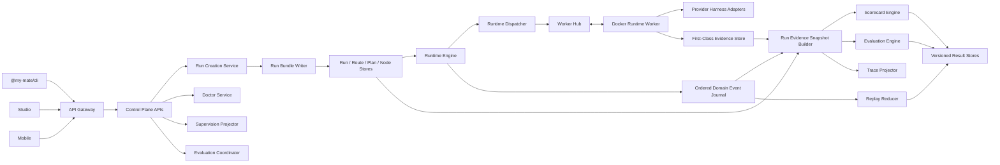
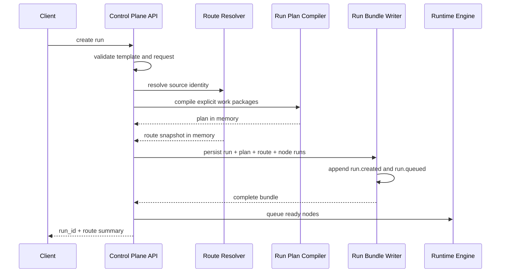
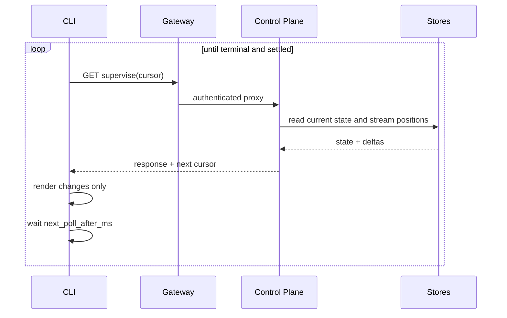
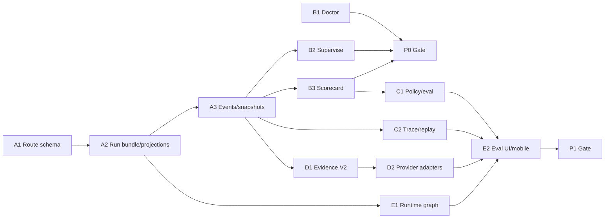

# My Mate P0-P1 Implementation Blueprint

Status: P0 and P1-C1/C2/D1/D2/E1/E2 implemented and verified.

Date: 2026-07-11

Related documents:

- `docs/25-homerail-human-flow-comparison.md`
- `docs/26-homerail-gap-closure-plan.md`
- `docs/24-homerail-like-runtime-contract-v1.md`

HomeRail reference:

- Repository: `https://github.com/xiaotianfotos/homerail`
- Verified commit: `a92f8d95962bbba73e9da53b54098bcec087cdbd`

This document turns the P0-P1 gap list into an executable design. It covers
runtime identity, evidence, operator commands, scorecards, evaluation, trace,
replay, provider-native evidence, and graph-first runtime UX.

### Implementation Status At 2026-07-11

P0 slices `A1` through `B3` are implemented. The repository now has canonical
route/work-package identity, initialization-safe run bundles, event journal V2,
frozen evidence snapshots, Doctor, cursor supervision, persisted pipeline
scorecards, Gateway exposure, and the Gateway-only CLI.

The real Docker acceptance flow has passed through Control Plane, API Gateway,
CLI, and two provisioned Worker containers. It reached `completed + settled`,
preserved two declared work packages, persisted two handoffs and two artifacts,
released all jobs/Workers/leases, and produced a `14/14 pass` scorecard. In the
same run, deterministic readiness was true while model readiness was false and
model verification remained `null`, proving that the two gates are not
conflated.

P1-D1 is also implemented: the shared streaming Harness Client, Evidence V2
sequence/source/trace/usage/reference fields, Worker and Control Plane
redaction, 32 KiB payload externalization, V1 compatibility, native-event
deduplication, schema validation, and synthetic fallback semantics are now in
place.

P1-D2 is implemented with stateful Codex, Claude SDK, Kimi, and OpenClaw
adapters, JSONL/bridge integration, recorded fixtures, an opt-in live runner,
exact-match versioned pricing, and runtime usage/cost/tool projection.

P1-C1 is implemented with data-only declarative policies, independent
evaluation verdicts, persisted APIs/CLI, deterministic quality assertions, and
an opt-in recoverable model judge queue.

P1-C2 is implemented with a first-class trace projector, pure runtime replay
reducer, persisted replay differences, deterministic replay-plan generation,
and frozen-plan reruns with lineage and HTTP idempotency. The real Docker
acceptance run replays all 57 V2 events exactly with no projection differences
or missing references.

The release-closure Docker smoke now verifies the complete read path through
API Gateway as well as the write/execution path. The same real two-Worker run
returns runtime projection V2 with two graph nodes, ten Evidence V2 records,
one scorecard, one evaluation, thirteen trace spans, and a persisted replay
with `pass`, 57 replayed events, zero projection differences, and zero missing
references. This is a surface-contract assertion, not only a Control Plane
store inspection.

P1-E1 is implemented with one deterministic shared layout used by authoring,
route comparison, and runtime views; a graph-first Studio runtime surface;
cursor-driven live refresh; compact run controls; URL-linked node selection;
keyboard topology navigation; a full evidence drawer; and narrow-screen list
fallback. Linear, branch, merge, waiting, failed/retry, and 20-node fixtures
pass deterministic bounds, endpoint, status-stability, and overlap checks.

P1-E2 is implemented with actionable Studio scorecard/evaluation/replay
controls, full verdict and finding summaries, Mobile depth/work-package
topology, a full-height node evidence sheet, trace and Evidence V2 projections,
and terminal-run scorecard/evaluation/replay actions. Mobile model tests and
browser acceptance cover branch/convergence topology, retry evidence,
provider-native tools, usage/cost, errors, trace, 390 x 844, 360 x 800, and
1440 x 900 layouts without page overflow or verdict overlap.
Doctor model mode currently validates host configuration and can perform an
opt-in live provider probe; it does not prove provider binaries inside every
custom Worker image.

## 1. Scope And Outcome

The target operator flow is:

```text
configure
  -> doctor
  -> create or confirm route
  -> run
  -> supervise
  -> scorecard
  -> eval
  -> trace
  -> replay or replay-plan
  -> rerun when required
```

The target product outcome is not command-name parity with HomeRail. It is a
single, auditable runtime truth that is consumed consistently by CLI, Studio,
Mobile, scorecards, evaluations, trace, and replay.

### 1.1 Included In P0

- Canonical route identity for every run.
- Explicit work-package identity in compiled plans.
- Canonical live and frozen evidence snapshots.
- Runtime event completeness required for supervision and later replay.
- Doctor API and CLI.
- Cursor-based supervise API and CLI.
- Minimum pipeline scorecard and persisted results.
- Gateway exposure, schemas, storage, compatibility, and tests for the above.

### 1.2 Included In P1

- Declarative scorecard policy and enforcement result.
- Separate pipeline, contract, evidence, usage, and quality verdicts.
- First-class trace spans.
- Audit replay, replay-plan, and linked rerun.
- Provider-native streaming evidence, usage, and cost.
- Graph-first Studio runtime view and compact Mobile topology.
- Provider fixture tests and visual acceptance.

### 1.3 Explicit Non-Goals

- Reproducing nondeterministic provider output byte-for-byte.
- Treating deterministic pipeline conformance as model answer quality.
- Making the CLI an independent scheduler or evaluator.
- Copying HomeRail's chat-shape tool inference.
- Copying HomeRail's replay naming when the operation is only diagnosis.
- Introducing continuous force-layout physics before deterministic layout is
  proven insufficient.
- Replacing all existing JSON-backed stores in this project phase.

## 2. Verified Pre-P0 Baseline Constraints

The following constraints were verified before P0 implementation and explain
the design choices below. Items 1-7 and 12 have since been closed by P0; items
8-10 remain inputs to the P1 provider-native evidence work. This section is a
historical baseline, not a description of the repository after 2026-07-10.

1. `RunPlanRecord` is persisted, but a run does not have a canonical route
   snapshot.
2. `CompiledNodeRecord` does not currently persist work-package identity.
3. `runtime-graph.ts` infers work packages from node name and type regexes.
4. Session and Mission route projections primarily depend on plan/proposal
   messages, so direct template runs can display `Unrouted`.
5. `buildRuntimeRunProjection` already joins graph, jobs, workers, leases,
   evidence, handoffs, and artifacts, but it is not an evaluation snapshot.
6. High-level run events do not cover every job, worker, lease, evidence, and
   handoff transition needed for complete replay.
7. `RuntimeEventCursorRecord` is an ingestion idempotency cursor per job. It is
   not a supervision cursor.
8. Command harnesses buffer aggregate stdout/stderr and return only at process
   completion.
9. `manager-client.ts` currently synthesizes `model_text` from progress
   reports instead of forwarding native provider events.
10. The runtime protocol declares `tool_call`, `tool_result`, and `usage`, but
    does not yet define their full correlation and usage contracts.
11. Studio is dependency-free JavaScript and already contains a deterministic
    topological authoring layout that can be extracted.
12. The Gateway exposes routes through an explicit method/path allowlist, so
    every new Control Plane API requires a matching Gateway rule and test.
13. The storage backend is an atomic JSON abstraction backed by files or a
    SQLite JSON helper. It does not provide a multi-record transaction.

## 3. Design Principles

### 3.1 Control Plane Owns Truth

The Control Plane owns route resolution, readiness, supervision projections,
scorecards, evaluations, trace, replay, and rerun lineage. CLI and UI render
the result and send commands; they do not recompute verdicts.

### 3.2 Runtime Status Is Not Evaluation Status

The following are independent:

- Runtime status: queued, running, waiting, completed, failed, cancelled.
- Pipeline verdict: scheduler, Worker, handoff, artifact, and cleanup health.
- Contract verdict: declared output and evidence contracts.
- Quality verdict: task-specific semantic result.

A completed run can fail a strict scorecard. The run remains truthfully
`completed`; its acceptance gate is `rejected`. Do not rewrite runtime history
as `failed` after evaluation.

### 3.3 Missing Is Not Zero

- Unknown usage is `unavailable`, not zero tokens.
- Unknown cost is `null`, not `$0.00`.
- Missing quality evaluation is `not_evaluated`, not PASS.
- Incomplete legacy replay is `partial`, not verified.

### 3.4 Immutable Inputs, Versioned Outputs

Run route, initial plan, and requested inputs are immutable audit inputs.
Runtime patches are separate records. Evaluation results store snapshot digest,
policy version, evaluator version, and pricing catalog version so later code
changes do not silently rewrite old conclusions.

### 3.5 Additive Compatibility First

New fields are additive during rollout. Legacy records are normalized on read.
No GET endpoint performs a destructive migration or writes back inferred data.
An explicit migration command may materialize compatibility projections later.

## 4. Target Architecture



### 4.1 Module Boundary

```text
packages/shared-types
  Runtime socket and evidence transport contracts

services/runtime-worker
  Provider adapters, streaming normalization, Worker-side redaction

services/control-plane/src/runtime
  Scheduling, Worker lifecycle, ordered domain events, live projections

services/control-plane/src/evaluation
  Snapshot, scorecard, eval, trace, replay, result stores

services/control-plane/src/diagnostics
  Doctor probes and readiness aggregation

apps/cli
  Thin HTTP client and terminal rendering

apps/studio
  Shared DAG layout, runtime graph, evidence drawer, result tabs

apps/mobile
  Compact topology, verdict summary, operator follow-up
```

## 5. P0 Foundation A: Canonical Route And Work Packages

### 5.1 Route Contract

Persist exactly one route snapshot per run:

```ts
type RunRouteSourceKind =
  | "session_plan"
  | "proposal"
  | "direct_template"
  | "rerun"
  | "legacy";

interface RunWorkPackageSnapshot {
  key: string;
  label: string;
  order: number;
  node_run_ids: string[];
  identity_source: "declared" | "compiler_default" | "legacy_inferred";
}

interface RunRouteSnapshot {
  schema_version: 1;
  run_id: string;
  route_id: string;
  source_kind: RunRouteSourceKind;
  session_id: string | null;
  proposal_id: string | null;
  plan_revision: number | null;
  plan_option: "primary" | "alternative" | null;
  source_run_id: string | null;
  template_id: string;
  template_version: number;
  template_name: string;
  node_count: number;
  edge_count: number;
  work_packages: RunWorkPackageSnapshot[];
  created_at: string;
}
```

Route ID rules:

| Source | Route ID |
| --- | --- |
| Confirmed session plan | `session:<sessionId>:r<revision>:<option>` |
| Confirmed proposal | `proposal:<proposalId>` |
| Direct template | `template:<templateId>@<version>` |
| Rerun | Reuse the immutable source `route_id` and set `source_run_id`. |
| Legacy | `legacy:<runId>` when source identity cannot be reconstructed. |

Route IDs identify the selected route, not a single execution attempt. Run IDs
identify execution attempts. This is why reruns reuse a route ID but get a new
run ID.

### 5.2 Explicit Work-Package Contract

Add an optional declaration to `WorkflowNode`:

```ts
interface WorkPackageBinding {
  key: string;
  label: string;
  order: number;
}

interface WorkflowNode {
  // Existing fields omitted.
  work_package?: WorkPackageBinding;
}
```

The compiler always materializes a binding into `CompiledNodeRecord`:

```ts
interface CompiledNodeRecord {
  // Existing fields omitted.
  work_package: WorkPackageBinding & {
    identity_source: "declared" | "compiler_default" | "legacy_inferred";
  };
}
```

Resolution order:

1. Use `WorkflowNode.work_package` when explicitly declared.
2. For a new template without a declaration, create one honest package per
   node using `key=node:<nodeId>`, the node name as label, and template order.
3. For an old stored run plan only, normalize the existing regex inference as
   `legacy_inferred`.

The planner and Studio authoring flow should encourage explicit grouping. The
compiler default preserves identity without claiming that a node belongs to a
business phase that was never declared.

Runtime graph, Studio, and Mobile must never run independent inference. The
existing `inferWorkPackage` logic moves behind a compatibility normalizer and
is deleted from runtime presentation code after migration coverage is proven.

### 5.3 Run Creation Flow



The run must not be dispatched until run, plan, route, node runs, and creation
events all exist.

### 5.4 Multi-Record Write Safety

The current storage interface has no cross-record transaction. Implement a
`RunBundleWriter` with these invariants:

1. Validate run, route, plan, node runs, and events in memory first.
2. Persist the bundle before calling `queueReadyNodes`.
3. Write an initialization marker with `state: preparing` before component
   writes and change it to `ready` after the bundle is complete.
4. Runtime recovery never dispatches a run whose marker is not `ready`.
5. If initialization fails, retain the partial records for audit, mark the
   marker `failed`, and return `run_initialization_failed`.
6. A recovery scan may finish a safe idempotent write or mark the run failed;
   it must not guess a missing route from UI messages.

For SQLite JSON storage this still uses existing atomic record writes. A true
multi-record database transaction is a later storage concern and is not
required to close this phase safely.

### 5.5 Projection Rules

- `GET /api/runs/:runId` includes `route` summary.
- Add `GET /api/runs/:runId/route` for the full snapshot.
- Session detail loads the latest run route when no plan/proposal message is
  available.
- Mission Workspace route and pipelines prefer the selected run route.
- Runtime graph uses compiled work packages only.
- Mobile uses the same route/work-package payload from the API.
- A legacy synthesized snapshot is visibly marked `source_kind=legacy`; it is
  still named and never rendered as `Unrouted`.

### 5.6 Storage And Schema Changes

Add:

```text
data/run-routes/<runId>.json
data/run-initialization/<runId>.json
schemas/workflow/run-route.schema.json
```

Update:

- `schemas/workflow/workflow-node.schema.json`
- `schemas/workflow/run-plan.schema.json`
- `services/control-plane/src/types.ts`
- `services/control-plane/src/config.ts`
- `services/control-plane/src/run-plan-compiler.ts`
- `services/control-plane/src/run-plan-store.ts`
- `services/control-plane/src/runtime-graph.ts`
- `services/control-plane/src/mission-workspace.ts`
- `services/control-plane/src/app.ts`
- `apps/mobile/lib/types.ts`
- `apps/mobile/lib/task-thread.ts`

## 6. P0 Foundation B: Event Completeness And Evidence Snapshots

### 6.1 Two Snapshot Modes

Do not use one object for live supervision and immutable evaluation.

1. `LiveRunEvidenceView` is built on demand and may change between requests.
   Supervise reads incremental records and does not persist a snapshot file.
2. `RunEvidenceSnapshot` is a frozen, versioned evaluation input. It is
   persisted by digest only after a run is terminal and runtime resources have
   settled, unless an explicit diagnostic call requests an incomplete snapshot.

### 6.2 Frozen Snapshot Contract

```ts
interface RunEvidenceSnapshot {
  schema_version: 1;
  snapshot_id: string;
  snapshot_state: "terminal" | "incomplete";
  generated_at: string;
  run: RunRecord;
  route: RunRouteSnapshot;
  initial_plan: RunPlanRecord;
  effective_plan: RunPlanRecord;
  node_runs: NodeRunRecord[];
  runtime_jobs: RuntimeJobRecord[];
  runtime_workers: RuntimeWorkerRecord[];
  worker_leases: WorkerLeaseRecord[];
  event_cursors: RuntimeEventCursorRecord[];
  events: EventRecord[];
  evidence: WorkerEvidence[];
  handoffs: NodeHandoffRecord[];
  artifacts: ArtifactRecord[];
  approvals: ApprovalRecord[];
  human_inputs: HumanInputRecord[];
  interventions: SessionInterventionRecord[];
  dag_patches: DagPatchRecord[];
  completeness: SnapshotCompleteness;
  snapshot_cursor: SupervisionCursor;
  evidence_digest: string;
}
```

`initial_plan` is the compiled plan at launch. `effective_plan` contains
accepted runtime patches. This prevents an applied patch from silently
rewriting the original execution intent.

Runtime workers are joined through run-scoped leases. Unrelated shared workers
must not enter cleanup verdicts.

### 6.3 Completeness Contract

```ts
interface SnapshotCompleteness {
  route: "complete" | "legacy_inferred" | "missing";
  events: "complete" | "legacy_partial" | "missing";
  evidence: "complete" | "partial" | "unavailable";
  usage: "complete" | "partial" | "unavailable";
  cost: "complete" | "partial" | "unavailable";
  redaction_blocked_count: number;
  late_record_count: number;
  blind_spots: string[];
}
```

Evaluators consume completeness explicitly. They do not infer completeness
from empty arrays.

### 6.4 Stable Ordering

Use the following order keys:

- Domain events: `(run_sequence, event_id)`.
- Worker evidence: `(job_id, sequence, evidence_id)`.
- Handoffs and artifacts: `(created_at, id)`.
- Jobs: `(created_at, dispatch_sequence, job_id)`.
- Nodes: compiled plan order, then `node_run_id`.

Add optional compatibility fields to `EventRecord`:

```ts
interface EventRecord {
  schema_version?: 2;
  run_sequence?: number;
  correlation_id?: string | null;
  causation_id?: string | null;
  idempotency_key?: string | null;
}
```

New events always use schema version 2 and a monotonically increasing
`run_sequence`. Legacy events are sorted by `(created_at, event_id)` and mark
event completeness as `legacy_partial`.

The current Control Plane is a single writer. If multi-writer deployment is
introduced, event sequence allocation must move into a transactional backend.

### 6.5 Runtime Event Coverage

Extend the event vocabulary so audit replay can reconstruct runtime state:

```text
job.created
job.dispatching
job.accepted
job.running
job.waiting_human
job.completed
job.failed
job.cancelled
worker.expected
worker.registered
worker.status_changed
worker.released
lease.acquired
lease.activated
lease.released
lease.failed
handoff.recorded
evidence.recorded
runtime.patch_applied
runtime.quiescent
scorecard.completed
evaluation.completed
```

Do not journal every heartbeat. Journal meaningful status transitions and keep
heartbeat timestamps in Worker/lease records.

`evidence.recorded` stores evidence ID, kind, digest, and correlation metadata,
not a duplicate sensitive payload. `handoff.recorded` stores the handoff ID and
routing outcome.

### 6.6 Digest Rules

1. Normalize records into canonical JSON with recursively sorted object keys.
2. Preserve array order defined above.
3. Remove `generated_at`, snapshot cursor, transient heartbeat timestamps, and
   presentation-only summaries from digest input.
4. Redact secret fields before canonicalization.
5. Hash the canonical UTF-8 bytes with SHA-256.
6. Store digest as `sha256:<lowercase hex>`.

Snapshot ID format:

```text
snapshot:<runId>:<first-16-digest-chars>
```

The same normalized evidence produces the same digest. Scorecard and eval
deduplicate on digest plus policy/evaluator version.

### 6.7 Terminal Settling

Do not freeze the snapshot immediately when `run.completed` is written. The
Worker may still be releasing its lease and final usage must arrive before the
terminal report.

A run is settled when:

- all runtime jobs are terminal;
- all run-scoped leases are released or failed;
- all ephemeral run-scoped workers are released or disconnected;
- the Worker message chain has processed the terminal event;
- no new evidence or handoff has arrived during the configured quiet window.

Default quiet window: 500 ms for deterministic/local fixtures. Make it
configurable for external providers. If settling exceeds the configured
timeout, freeze an incomplete snapshot with cleanup and late-evidence blind
spots instead of hanging indefinitely.

### 6.8 Snapshot Storage

```text
data/evaluation-snapshots/<runId>/<digestHex>.json
data/run-plan-initial/<runId>.json
```

The full `sha256:<hex>` digest remains inside the record. Use only the hex
portion as the filename so the file backend remains valid on Windows.

The existing storage export/import recursively includes new JSON directories.
Add explicit round-trip tests so this remains guaranteed.

## 7. P0 Operator Loop A: Doctor

### 7.1 Responsibility Split

- Calling the API through Gateway proves Gateway reachability and
  authentication.
- The Control Plane doctor service checks storage, runtime, Docker, Worker Hub,
  workspace, harness, and provider configuration.
- CLI renders the report and chooses an exit code.
- No secret value is returned.

### 7.2 API

```http
POST /api/diagnostics/doctor
Content-Type: application/json

{
  "mode": "quick | docker | model",
  "runtime": "local | docker-worker | openclaw | codex | claude-sdk | kimi",
  "model_probe": false
}
```

`model_probe=true` is opt-in because it may incur provider cost. Configuration
presence alone sets model readiness; only a live probe sets model verification.

```ts
interface DoctorCheck {
  id: string;
  category: "control_plane" | "storage" | "runtime" | "docker" |
    "worker" | "workspace" | "harness" | "provider";
  status: "pass" | "warn" | "fail" | "skipped";
  required_for: Array<"runtime" | "deterministic" | "model">;
  summary: string;
  detail: string | null;
  remediation: string | null;
  duration_ms: number;
}

interface DoctorReport {
  schema_version: 1;
  report_id: string;
  generated_at: string;
  runtime_ready: boolean;
  deterministic_ready: boolean;
  model_ready: boolean;
  model_verified: boolean | null;
  storage_backend: string;
  runtime_dispatcher: string;
  checks: DoctorCheck[];
}
```

### 7.3 Check Matrix

| Check | Quick | Docker | Model | Failure Effect |
| --- | --- | --- | --- | --- |
| Control Plane process | yes | yes | yes | All readiness false. |
| Gateway authentication | proven by request | proven | proven | CLI connectivity failure. |
| Storage write/read probe | yes | yes | yes | Runtime false. |
| Run directories/config | yes | yes | yes | Runtime false. |
| Dispatcher configured | yes | yes | yes | Runtime false. |
| Worker Hub attached | when worker mode | yes | when needed | Deterministic/model false for Worker path. |
| Docker CLI version | no | yes | if Docker provider path | Deterministic/model Docker false. |
| Linux daemon | no | yes | if needed | Docker false. |
| Worker image inspect | no | yes | if needed | Docker false. |
| Image protocol/version label | no | yes | if needed | Docker false or warning by compatibility. |
| Disposable mount read/write | no | yes | if needed | Deterministic/model Docker false. |
| Worker WS registration loopback | optional | yes | if needed | Worker path false. |
| Harness command/config | relevant runtime | relevant | yes | Runtime-specific readiness false. |
| Provider credential reference | no | no | yes | Model false. |
| Live provider request | no | no | opt-in | `model_verified=false` on failure. |

Storage probe overwrites a single diagnostics JSON record with a nonce, reads
it back, and verifies equality. It does not create unbounded probe files.

Docker probes use argument arrays with `spawn`, never shell-concatenated user
input. The disposable mount probe uses the configured Worker image and removes
its own probe container.

### 7.4 CLI

```text
my-mate doctor [--mode quick|docker|model]
               [--runtime <kind>]
               [--model-probe]
               [--json]
```

Examples:

```text
my-mate doctor --mode docker
my-mate doctor --mode model --runtime claude-sdk
my-mate doctor --mode model --runtime codex --model-probe
```

The human output groups checks by category and prints remediation only for
warn/fail. JSON output is the unmodified API contract.

## 8. P0 Operator Loop B: Supervise

### 8.1 API

```http
GET /api/runs/:runId/supervise?cursor=<opaque>&limit=100
```

```ts
interface SuperviseRunResponse {
  schema_version: 1;
  run_id: string;
  route: RunRouteSummary;
  status: RunStatus;
  settled: boolean;
  graph_revision: number;
  frontier: string[];
  changed_nodes: RuntimeGraphNode[];
  resources: {
    active_jobs: number;
    connected_ephemeral_workers: number;
    active_leases: number;
  };
  gates: {
    approvals: ApprovalRecord[];
    human_inputs: HumanInputRecord[];
  };
  deltas: {
    events: EventRecord[];
    evidence: WorkerEvidenceSummary[];
    handoffs: NodeHandoffRecord[];
    artifacts: ArtifactRecord[];
  };
  cursor: string;
  has_more: boolean;
  next_poll_after_ms: number;
}
```

### 8.2 Cursor Contract

The cursor is an opaque Base64URL-encoded, versioned object containing:

- run ID;
- last domain event `(run_sequence, event_id)`;
- last evidence `(job_id, sequence, evidence_id)`;
- last handoff `(created_at, handoff_id)`;
- last artifact `(created_at, artifact_id)`;
- graph revision.

It is distinct from `RuntimeEventCursorRecord`, which rejects duplicate or
out-of-order Worker events during ingestion.

Cursor rules:

1. Reject a malformed cursor with `400 invalid_cursor`.
2. Reject a cursor for another run.
3. Never use array length as a position.
4. Limit each response and set `has_more` when records remain.
5. Return a cursor even when no delta exists.
6. Permit a client to restart from no cursor and receive the current state plus
   bounded recent deltas.

### 8.3 Follow Flow



### 8.4 CLI

```text
my-mate supervise <run_id> [--follow]
                                  [--cursor <cursor>]
                                  [--interval <ms>]
                                  [--timeout <sec>]
                                  [--json | --json-lines]
```

- Default mode performs one tick.
- `--follow` ends only when the run is terminal and settled, or on timeout.
- Human output prints state changes and periodic heartbeat summaries, not the
  entire run on every poll.
- JSON Lines emits one response per poll for automation.
- Ctrl+C exits without changing the run.

## 9. P0 Operator Loop C: Minimum Pipeline Scorecard

### 9.1 Minimum Checks

The first scorecard closes operational verification before semantic eval is
introduced.

1. Route, initial plan, and effective plan exist.
2. Run reached an expected terminal state.
3. Every compiled node has exactly one current node-run projection.
4. Node and run terminal states are consistent.
5. Retry attempts remain within declared policy.
6. Every taken edge has the expected non-empty handoff when required.
7. Required artifacts exist and references resolve.
8. No run-scoped active job remains.
9. No run-scoped active lease remains.
10. No ephemeral run-scoped Worker remains connected or busy.
11. Worker event sequences are ordered and idempotency rejection counts are
    visible.
12. No terminal state regressed.
13. Pending approval or human-input gates are consistent with final status.
14. Blocked redaction and missing evidence are surfaced as blind spots.

### 9.2 Result Contract

```ts
type FindingSeverity = "error" | "warning" | "blind_spot" | "info";

interface ScorecardFinding {
  check_id: string;
  severity: FindingSeverity;
  passed: boolean;
  summary: string;
  detail: string;
  evidence_refs: string[];
}

interface ScorecardResult {
  schema_version: 1;
  scorecard_id: string;
  run_id: string;
  snapshot_id: string;
  evidence_digest: string;
  profile: string;
  policy_version: number;
  enforcement: "off" | "advisory" | "strict";
  pipeline_verdict: "pass" | "fail" | "incomplete";
  gate_verdict: "pass" | "reject" | "not_enforced";
  passed_checks: number;
  total_checks: number;
  hard_error_count: number;
  warning_count: number;
  blind_spot_count: number;
  findings: ScorecardFinding[];
  created_at: string;
}
```

The numeric score is presentation only. Automation uses verdict and findings.

### 9.3 API And Persistence

```http
POST /api/runs/:runId/scorecards
GET  /api/runs/:runId/scorecards
GET  /api/runs/:runId/scorecards/:scorecardId
```

POST request options:

```json
{
  "profile": "pipeline-v1",
  "allow_incomplete": false
}
```

Persist:

```text
data/scorecards/<runId>/<scorecardId>.json
```

The deduplication key is evidence digest + profile + policy version. Repeating
the request returns the existing result unless `force=true` is explicitly
supported for development.

## 10. CLI Package Architecture

Create `apps/cli` as `@my-mate/cli`.

```text
apps/cli/
  package.json
  tsconfig.json
  src/index.ts
  src/client.ts
  src/config.ts
  src/output.ts
  src/commands/doctor.ts
  src/commands/run.ts
  src/commands/supervise.ts
  src/commands/scorecard.ts
  src/commands/eval.ts
  src/commands/trace.ts
  src/commands/replay.ts
  src/commands/replay-plan.ts
  src/commands/rerun.ts
  test/*.test.ts
```

Use Commander only for parsing. Use Node's built-in `fetch` for HTTP.

Configuration precedence:

1. Command option.
2. `MY_MATE_BASE_URL` and `MY_MATE_API_KEY`.
3. User config file.
4. Default Gateway URL `http://127.0.0.1:4030`.

The user config path is `~/.my-mate/config.json` on Unix-like systems and
`%USERPROFILE%\.my-mate\config.json` on Windows. The initial config contains
only base URL and credential reference; it must not write a plaintext API key
unless the user explicitly chooses that storage mode.

The API key is sent as a Bearer token and is never printed by `--json` or
debug logging.

Exit codes:

| Code | Meaning |
| --- | --- |
| 0 | Operation completed and requested gate passed. |
| 1 | Scorecard/evaluation/replay verification failed. |
| 2 | Invalid command arguments or invalid local configuration. |
| 3 | Gateway, Control Plane, or runtime readiness failure. |
| 4 | Operation timed out or was interrupted. |

`eval` with quality `not_evaluated` exits 0 by default because that is an
explicit result, not an execution error. `--require-quality` converts it to a
gate failure.

## 11. P1 Evaluation A: Declarative Scorecard

Implementation status: complete and verified on 2026-07-10.

### 11.1 Template Policy

Extend `TemplatePolicy` additively:

```ts
interface ScorecardPolicy {
  profile: string;
  version: number;
  enforcement: "off" | "advisory" | "strict";
  settle_timeout_seconds: number;
  checks: ScorecardCheckDefinition[];
}

interface TemplatePolicy {
  // Existing fields omitted.
  scorecard?: ScorecardPolicy;
}
```

Old templates normalize to:

```json
{
  "profile": "pipeline-v1",
  "version": 1,
  "enforcement": "advisory",
  "settle_timeout_seconds": 30,
  "checks": []
}
```

### 11.2 Declarative Check Types

```ts
type ScorecardCheckDefinition =
  | RequiredEvidenceCheck
  | RequiredToolCheck
  | ArtifactContractCheck
  | HandoffSchemaCheck
  | TestCategoryCheck
  | DeterministicAssertionCheck;
```

Supported first-release checks:

- Required evidence kinds by node or work package.
- Required tool names and minimum/maximum call counts.
- Required artifact type, MIME type, name pattern, and resolvable URI.
- JSON Schema validation for handoff content and artifact metadata.
- Structured test categories: lint, unit, integration, security, rollback.
- Deterministic equality, contains, regex, numeric range, and JSONPath-like
  field assertions over explicitly selected evidence.

Do not allow arbitrary JavaScript in policy. Checks are data and are validated
by JSON Schema.

### 11.3 Enforcement Semantics

| Enforcement | Compute | Persist | Gate Verdict |
| --- | --- | --- | --- |
| off | Optional/manual | yes when requested | `not_enforced` |
| advisory | yes | yes | warnings do not reject |
| strict | yes | yes | any hard error rejects |

Strict rejection does not mutate runtime status. It blocks acceptance in CLI,
Studio, and future automation through `gate_verdict=reject`.

## 12. P1 Evaluation B: Eval

Implementation status: complete and verified on 2026-07-10. Default offline
acceptance uses `none` or `deterministic-v1`; the Anthropic judge and live test
remain explicitly opt-in.

### 12.1 Independent Verdicts

```ts
interface EvaluationResult {
  schema_version: 1;
  evaluation_id: string;
  run_id: string;
  snapshot_id: string;
  evidence_digest: string;
  scorecard_id: string;
  evaluator: {
    id: string;
    kind: "none" | "deterministic" | "model";
    version: string;
    provider: string | null;
    model: string | null;
    prompt_version: string | null;
  };
  pipeline_verdict: "pass" | "fail" | "incomplete";
  contract_verdict: "pass" | "fail" | "not_applicable" | "incomplete";
  evidence_verdict: "complete" | "partial" | "unavailable";
  usage_verdict: "complete" | "partial" | "unavailable";
  quality_verdict: "pass" | "fail" | "not_evaluated" | "error";
  gate_verdict: "pass" | "reject" | "not_enforced";
  findings: EvaluationFinding[];
  evaluator_usage: UsageSummary | null;
  status: "queued" | "running" | "completed" | "failed";
  created_at: string;
  completed_at: string | null;
}
```

There is deliberately no ambiguous single `PASS` field.

### 12.2 Evaluator Modes

- `none`: quality is `not_evaluated`.
- `deterministic`: versioned rubric code or policy assertions; no provider.
- `model`: separately configured judge model.

Model evaluator requirements:

1. Store provider, model, rubric ID, prompt version, and evaluator usage.
2. Use a structured JSON result validated by schema.
3. Treat parse failure or provider error as quality `error`, never FAIL.
4. Do not expose hidden credentials or raw sensitive evidence to the judge.
5. Allow an evaluation-specific redacted evidence view.
6. Keep model eval opt-in in normal test and developer workflows.

### 12.3 API

```http
POST /api/runs/:runId/evaluations
GET  /api/runs/:runId/evaluations
GET  /api/runs/:runId/evaluations/:evaluationId
```

Model evaluations return `202` and are polled by CLI/Studio. Deterministic and
none evaluators may complete synchronously but use the same persisted state
machine.

Model evaluation runs in an independent `EvaluationQueue`, not as a node in the
source run. This prevents judge prompts, tools, and usage from contaminating
the evidence being judged. Queue behavior:

1. Persist the evaluation as `queued` before scheduling work.
2. Transition to `running` with an attempt number and start time.
3. Call a versioned `EvaluatorProvider` through the evaluator registry.
4. Persist structured output and evaluator usage before `completed`.
5. On process restart, resume queued work and recover stale running work once;
   after the retry budget, persist `failed` with quality verdict `error`.
6. Never change the source run status from the evaluation queue.

Persist:

```text
data/evaluations/<runId>/<evaluationId>.json
```

## 13. P1 Trace

### 13.1 Span Model

```ts
interface TraceSpan {
  span_id: string;
  parent_span_id: string | null;
  trace_id: string;
  run_id: string;
  node_run_id: string | null;
  job_id: string | null;
  kind: "run" | "node" | "job" | "model" | "tool" |
    "handoff" | "artifact" | "control";
  name: string;
  status: "ok" | "error" | "unknown";
  started_at: string;
  finished_at: string | null;
  input_ref: string | null;
  output_ref: string | null;
  tool_call_id: string | null;
  provider: string | null;
  model: string | null;
  usage: UsageSummary | null;
  attributes: Record<string, string | number | boolean | null>;
}
```

Hierarchy:

```text
run
  node
    job attempt
      model turn
        tool call
      handoff
      artifact
```

Trace is projected from first-class events and evidence. It never scans chat
text for provider-specific shapes.

### 13.2 Correlation Rules

- `trace_id` is stable per run.
- Runtime job creates the job span.
- Provider turn creates a model span.
- `tool_call_id` pairs tool call and result.
- Handoff parent is the producing job span.
- Artifact parent is the evidence/job span that produced it.
- Missing start or finish data produces `status=unknown`, not invented timing.

### 13.3 API And CLI

```http
GET /api/runs/:runId/trace?node_run_id=<id>&cursor=<cursor>&limit=200
```

```text
my-mate trace <run_id> [--node <node_run_id>]
                             [--kind <kind>]
                             [--json]
```

Human output renders a stable indented tree with duration, tools, usage, and
errors. Studio uses the same span response for the node drawer timeline.

## 14. P1 Replay, Replay-Plan, And Rerun

### 14.1 Audit Replay

`replay` rebuilds state from immutable route, initial plan, domain events, and
referenced evidence metadata. It does not invoke a provider or Worker.

Implement a pure `RuntimeStateReducer`:

```ts
function reduceRuntimeState(
  state: ReplayRuntimeState,
  event: EventRecord,
): ReplayRuntimeState;
```

Replay compares reduced state with persisted run, plan, node, job, lease,
handoff, and artifact projections.

```ts
interface ReplayResult {
  replay_id: string;
  run_id: string;
  event_completeness: "complete" | "legacy_partial";
  verification: "pass" | "fail" | "partial";
  processed_events: number;
  first_sequence: number | null;
  last_sequence: number | null;
  projection_differences: ReplayDifference[];
  missing_references: string[];
  created_at: string;
}
```

Legacy runs without complete lifecycle events can only return `partial`.

### 14.2 Replay Plan

`replay-plan` consumes scorecard, evaluation, trace, and replay differences to
produce categorized recommendations:

- runtime environment;
- scheduler/dispatch;
- provider/harness;
- prompt/agent assignment;
- handoff contract;
- artifact contract;
- evidence completeness;
- policy/evaluator;
- human gate;
- budget/usage.

Each recommendation references findings and proposes a change target. It must
not edit templates or prompts automatically in P1.

### 14.3 Rerun

`rerun` creates a new run using:

- the original immutable route ID;
- the original template ID/version or frozen effective template reference;
- original inputs after authorization/redaction rules;
- optional explicitly supplied input overrides;
- a new run ID;
- `source_run_id` and rerun reason.

Provider output is expected to differ unless the harness is deterministic.

Use `Idempotency-Key` on rerun POST so a CLI retry cannot create duplicate
runs.

### 14.4 API

```http
POST /api/runs/:runId/replays
GET  /api/runs/:runId/replays/:replayId
POST /api/runs/:runId/replay-plans
GET  /api/runs/:runId/replay-plans/:replayPlanId
POST /api/runs/:runId/reruns
```

Persistence:

```text
data/replays/<runId>/<replayId>.json
data/replay-plans/<runId>/<replayPlanId>.json
```

## 15. P1 Provider-Native Evidence

Implementation status: D1 transport/compatibility and D2 provider adapters are
complete. Recorded fixtures cover all supported adapter families; live calls
remain explicitly opt-in.

### 15.1 Harness Interface

D1 replaces the aggregate-only harness boundary with streaming normalization:

```ts
interface HarnessClient {
  execute(
    job: RuntimeWorkerJob,
    emit: (event: HarnessEvidenceEvent) => Promise<void>,
    signal: AbortSignal,
  ): Promise<HarnessResult>;
}
```

Provider adapters may consume token deltas internally, but the persisted stream
uses complete semantic records rather than one record per token.

Persist immediately:

- model turn start/completion;
- completed assistant text block;
- tool call;
- tool result;
- usage update/final usage;
- artifact reference;
- handoff;
- provider error.

### 15.2 Evidence Contract V2

Additive fields keep protocol V1 transport compatible during rollout:

```ts
interface WorkerEvidence {
  evidence_schema_version?: 1 | 2;
  evidence_id: string;
  run_id: string;
  node_run_id: string;
  job_id: string;
  worker_id: string;
  sequence?: number;
  kind: WorkerEvidenceKind;
  source?: {
    provider: string | null;
    model: string | null;
    native_event_id: string | null;
    synthetic: boolean;
  };
  trace?: {
    trace_id: string;
    span_id: string;
    parent_span_id: string | null;
    tool_call_id: string | null;
  };
  summary: string;
  input_ref?: string | null;
  output_ref?: string | null;
  storage_uri: string | null;
  inline_payload: unknown;
  usage?: UsageSummary | null;
  redaction_status: "not_required" | "redacted" | "blocked";
  created_at: string;
}
```

The Control Plane normalizes old evidence to schema version 1 and marks source
synthetic/unknown. New Worker images always emit a sequence and schema version
2.

### 15.3 Usage And Cost

```ts
interface UsageSummary {
  availability: "available" | "partial" | "unavailable";
  input_tokens: number | null;
  output_tokens: number | null;
  cache_read_tokens: number | null;
  cache_write_tokens: number | null;
  reasoning_tokens: number | null;
  total_tokens: number | null;
  duration_ms: number | null;
  turn_count: number | null;
  provider_reported_cost: MoneyAmount | null;
  estimated_cost: EstimatedMoneyAmount | null;
}

interface MoneyAmount {
  currency: string;
  amount_decimal: string;
}

interface EstimatedMoneyAmount extends MoneyAmount {
  catalog_id: string;
  catalog_version: string;
}
```

Rules:

1. Provider-reported and estimated cost are separate.
2. Decimal strings avoid floating-point currency drift.
3. Missing token dimensions remain null.
4. Unknown model pricing produces `estimated_cost=null`.
5. An estimate records immutable catalog ID/version.
6. Deterministic/local harness emits `availability=unavailable`, never zeros.
7. Run totals aggregate only known values and preserve completeness status.

Pricing estimates are computed by the Control Plane, not the Worker. Keep
the versioned catalog contract under
`services/control-plane/src/evaluation/pricing/`. The default catalog is empty;
`MY_MATE_PRICING_CATALOG_PATH` may point to a validated deployment catalog. The
catalog key is provider + exact model identifier. An unknown alias or model
version does not fall back to a similarly named price.

### 15.4 Tool Correlation

- Tool calls require a stable `tool_call_id`.
- Results reference the same ID.
- Duplicate native events are ignored by `(job_id, native_event_id)` or the
  normalized evidence idempotency key.
- Missing results create an open/unknown tool span and an evidence finding.
- Tool errors are results with error status, not missing results.

### 15.5 Redaction And Payload Size

Redact twice:

1. Worker-side before WebSocket transport.
2. Control Plane defense-in-depth before persistence.

Redaction covers:

- known credential environment names;
- bearer/API key patterns;
- configured secret field paths;
- provider-specific credential shapes;
- tool arguments declared sensitive by tool metadata.

Inline evidence payload limit: 32 KiB after redaction. Larger content is written
to the run workspace and referenced by URI. The inline payload retains a safe
summary, content digest, byte size, and reference.

`redaction_status=blocked` means the payload could not be persisted safely. The
record is still stored with metadata so evaluators report a blind spot.

### 15.6 Adapter Implementation

| Adapter | Implemented Input | Recorded Fixture Evidence |
| --- | --- | --- |
| Local deterministic | Explicit synthetic events | unavailable usage, artifact, handoff |
| Codex | JSONL/native response item parser | text, tool call/result, usage, error |
| Claude SDK | content block and usage callbacks | thinking/text, tool use/result, usage |
| Kimi | native stream event parser | text, tool call/result, usage |
| OpenClaw | bridge callback/stream normalization | task/session refs, tools, usage when present |

Command JSONL is parsed during process execution; OpenClaw consumes bridge
`events/evidence`. Unrecognized output remains a compatibility fallback marked
`synthetic=true` and cannot claim provider-native usage or tools. Recognized
streams that omit usage receive a separate synthetic unavailable marker.

### 15.7 Message Ordering

The Worker emits all evidence, usage, handoffs, and artifacts before the
terminal Worker report. Messages for a job are sent in sequence on the same
socket. The Manager processes them through its existing serialized message
chain. A terminal snapshot cannot be frozen until this chain and resource
cleanup settle.

## 16. P1 Graph-First Runtime UX

### 16.1 Information Architecture

The default running/completed run view becomes:

```text
Compact run toolbar
  status | route | duration | nodes | usage/cost completeness | controls

Spatial DAG canvas
  stable topology and current state

Right node drawer
  summary | attempts | prompt | tools | usage | handoffs | artifacts | errors

Secondary tabs
  timeline | scorecard/eval | trace | raw evidence | route changes
```

MissionSpec, requested outputs, and intervention remain available, but they do
not compete with the DAG for primary runtime attention.

### 16.2 Shared Layout API

Extract the authoring algorithm into:

```text
apps/studio/src/dag-layout.js
```

```ts
interface DagLayoutNodeInput {
  id: string;
  order: number;
  width: number;
  height: number;
}

interface DagLayoutEdgeInput {
  id: string;
  from: string;
  to: string;
}

function buildDagLayout(
  nodes: DagLayoutNodeInput[],
  edges: DagLayoutEdgeInput[],
  options?: DagLayoutOptions,
): DagLayoutModel;
```

Layout rules:

1. Kahn topological depth determines columns.
2. Input order then node ID determines stable order inside a column.
3. Fan-out and fan-in barycenter ordering reduces crossings.
4. Fixed node dimensions and row/column gaps prevent overlap.
5. Cyclic/invalid nodes render in an explicit invalid column; runtime plans
   should already reject cycles.
6. Coordinates remain stable when only runtime status changes.
7. Layout returns bounds for fit-to-view and future minimap support.

Use the same function for authoring, route comparison, and runtime views.

### 16.3 Runtime Graph Model

Each runtime node includes:

- node and node-run identity;
- explicit work package;
- status and progress;
- current attempt and max attempts;
- start/finish/duration;
- active job/Worker/lease IDs;
- tool call and failure counts;
- usage summary and completeness;
- artifact and handoff counts;
- human gate state;
- error summary.

Node surface remains low noise:

- title and role;
- status marker;
- one secondary line;
- compact badges for retry, tool failure, token availability, and duration.

Full IDs and payloads belong in the drawer.

### 16.4 Edge Model

- Label port and condition when present.
- Active handoff uses restrained motion.
- Satisfied edge is solid.
- Pending edge is muted.
- Blocked/failed branch is visually distinct.
- Untaken conditional branch is marked skipped, not failed.
- Handoff selection opens the referenced evidence in the drawer.

### 16.5 Interaction

- Click or keyboard-select a node to open the drawer.
- Arrow keys move through topological neighbors.
- Escape closes the drawer.
- Fit-to-view is an icon button with tooltip.
- Zoom controls use familiar icons; no text-filled tool buttons where a common
  icon exists.
- URL stores selected run and node for reload/deep-link behavior.
- A list fallback remains available for accessibility and very narrow screens.

### 16.6 Live Updates

Studio may continue using the existing session stream for broad workspace
updates. The selected run uses supervise cursors for precise deltas. Status
changes update the existing positioned node; they do not rebuild layout unless
topology revision changes.

### 16.7 Mobile

Mobile renders a compact topological timeline grouped by depth/work package:

- horizontal depth or vertically stacked stages depending on viewport;
- branch markers and convergence indicators;
- tap opens a full-height node evidence sheet;
- scorecard/eval summary follows the graph;
- never shrink the desktop canvas into unreadable nodes.

### 16.8 Visual Acceptance

Add Playwright-based fixtures for:

1. Two-node linear success.
2. Parallel fan-out and fan-in.
3. Conditional success/failure branches.
4. Waiting-human node.
5. Failed node with retry.
6. Twenty-node mixed graph.
7. Long node and work-package names.
8. Missing usage and partial evidence.

Viewports:

- 1440 x 900 desktop.
- 1280 x 720 compact desktop.
- 390 x 844 mobile.
- 360 x 800 narrow mobile.

Checks:

- no node overlap;
- no text overflow;
- no toolbar/drawer/canvas overlap;
- graph bounds are nonzero;
- selected node remains visible;
- primary canvas is nonblank;
- edge endpoints connect to node boundaries;
- terminal, failed, waiting, and running states are visually distinct.

## 17. Complete API Surface

| Priority | Method | Path | Purpose |
| --- | --- | --- | --- |
| P0 | GET | `/api/runs/:runId/route` | Canonical route snapshot. |
| P0 | GET | `/api/runs/:runId/supervise` | Cursor-based runtime deltas. |
| P0 | POST | `/api/diagnostics/doctor` | Readiness probes. |
| P0 | POST | `/api/runs/:runId/scorecards` | Create/deduplicate scorecard. |
| P0 | GET | `/api/runs/:runId/scorecards` | List scorecards. |
| P0 | GET | `/api/runs/:runId/scorecards/:id` | Scorecard detail. |
| P1 | POST | `/api/runs/:runId/evaluations` | Start evaluation. |
| P1 | GET | `/api/runs/:runId/evaluations` | List evaluations. |
| P1 | GET | `/api/runs/:runId/evaluations/:id` | Evaluation state/result. |
| P1 | GET | `/api/runs/:runId/trace` | Trace span projection. |
| P1 | POST | `/api/runs/:runId/replays` | Audit replay. |
| P1 | GET | `/api/runs/:runId/replays/:id` | Replay result. |
| P1 | POST | `/api/runs/:runId/replay-plans` | Improvement plan. |
| P1 | GET | `/api/runs/:runId/replay-plans/:id` | Replay-plan result. |
| P1 | POST | `/api/runs/:runId/reruns` | Linked new run. |

Every route requires:

- Control Plane handler and service method;
- Gateway allowlist rule;
- Gateway proxy test;
- request/response validation;
- consistent `400/401/404/409/422/500` error contract;
- `X-Request-Id` propagation where supplied.

Error responses use:

```ts
interface ApiError {
  code: string;
  message: string;
  details?: Record<string, unknown>;
  request_id?: string;
}
```

Use `409` for a valid operation in an incompatible runtime state, `422` for a
well-formed request that violates a policy/schema contract, and `500` only for
unexpected server failures. Async operations return their persisted resource
with `202`, not a long-running open HTTP request.

Raw frozen snapshots are not exposed by default. Add a protected diagnostic
endpoint only if required; normal clients use scorecard/eval/trace projections.

## 18. File-By-File Implementation Map

### 18.1 Shared Types And Schemas

Update:

- `packages/shared-types/src/runtime-protocol.ts`: evidence V2, usage, source,
  trace, and sequence fields.
- `packages/shared-types/README.md`: compatibility and provider evidence
  semantics.
- `schemas/workflow/workflow-node.schema.json`: optional work package binding.
- `schemas/workflow/run-plan.schema.json`: required compiled binding for new
  plans with legacy normalization support.
- `schemas/workflow/event.schema.json`: event V2 sequencing/correlation.
- `schemas/common/enums.schema.json`: lifecycle event vocabulary.
- `schemas/workflow/workflow-template.schema.json`: optional scorecard policy.
- `openapi/control-plane.openapi.yaml`: all P0-P1 paths, schemas, errors,
  cursors, pagination, and asynchronous operation responses.

Add:

```text
schemas/workflow/run-route.schema.json
schemas/evaluation/run-evidence-snapshot.schema.json
schemas/evaluation/scorecard-policy.schema.json
schemas/evaluation/scorecard-result.schema.json
schemas/evaluation/evaluation-result.schema.json
schemas/evaluation/replay-result.schema.json
schemas/evaluation/replay-plan-result.schema.json
```

### 18.2 Control Plane Runtime Truth

Update:

- `services/control-plane/src/types.ts`: route, work package, event, result,
  and lineage types.
- `services/control-plane/src/config.ts`: new data directories and settling
  configuration.
- `services/control-plane/src/validators.ts`: compile new JSON Schemas.
- `services/control-plane/src/run-plan-compiler.ts`: explicit/default package
  materialization and initial plan capture.
- `services/control-plane/src/run-plan-store.ts`: legacy plan normalization.
- `services/control-plane/src/run-store.ts`: rerun lineage normalization.
- `services/control-plane/src/event-store.ts`: run sequence, correlation, and
  V2 append contract.
- `services/control-plane/src/runtime-graph.ts`: remove presentation inference
  and expose richer runtime node facts.
- `services/control-plane/src/runtime/runtime-engine.ts`: lifecycle journal and
  runtime-quiescent hook.
- `services/control-plane/src/runtime/runtime-run-projection.ts`: canonical
  route and evaluation summaries.
- `services/control-plane/src/runtime-worker-hub.ts`: Worker/evidence sequence
  validation and quiescence notification.
- `services/control-plane/src/worker-runtime-dispatcher.ts`: job/lease/Worker
  lifecycle events.
- `services/control-plane/src/runtime/runtime-recovery.ts`: incomplete bundle
  and queued evaluation recovery.

Add:

```text
services/control-plane/src/run-route-store.ts
services/control-plane/src/run-initialization-store.ts
services/control-plane/src/run-initial-plan-store.ts
services/control-plane/src/run-bundle-writer.ts
services/control-plane/src/runtime/supervision-cursor.ts
services/control-plane/src/runtime/supervision-projector.ts
```

### 18.3 Control Plane Diagnostics And Evaluation

Add:

```text
services/control-plane/src/diagnostics/types.ts
services/control-plane/src/diagnostics/doctor-service.ts
services/control-plane/src/diagnostics/storage-probe.ts
services/control-plane/src/diagnostics/docker-probe.ts
services/control-plane/src/diagnostics/worker-probe.ts
services/control-plane/src/diagnostics/provider-probe.ts

services/control-plane/src/evaluation/types.ts
services/control-plane/src/evaluation/canonical-json.ts
services/control-plane/src/evaluation/redaction.ts
services/control-plane/src/evaluation/run-evidence-snapshot.ts
services/control-plane/src/evaluation/snapshot-store.ts
services/control-plane/src/evaluation/scorecard-engine.ts
services/control-plane/src/evaluation/scorecard-store.ts
services/control-plane/src/evaluation/checks/*.ts
services/control-plane/src/evaluation/evaluator-registry.ts
services/control-plane/src/evaluation/evaluation-queue.ts
services/control-plane/src/evaluation/evaluation-store.ts
services/control-plane/src/evaluation/trace-projector.ts
services/control-plane/src/evaluation/runtime-state-reducer.ts
services/control-plane/src/evaluation/replay-engine.ts
services/control-plane/src/evaluation/replay-store.ts
services/control-plane/src/evaluation/replay-plan-engine.ts
services/control-plane/src/evaluation/rerun-service.ts
services/control-plane/src/evaluation/pricing/catalogs/*.json
```

`services/control-plane/src/app.ts` wires HTTP validation to these services. It
must not contain scorecard checks or replay reduction logic inline.

Add focused Control Plane test modules for route snapshots, supervision,
diagnostics, snapshots, scorecards, evaluations, trace, and replay, then import
them from `services/control-plane/test/all.test.ts`.

### 18.4 Gateway

Update:

- `services/api-gateway/src/app.ts`: explicit route/method rules.
- `services/api-gateway/test/app.test.ts`: allowed, denied, authenticated, and
  async response proxy cases.

Long-running model evaluation remains asynchronous so the existing Gateway
request timeout does not need to hold a provider connection open.

### 18.5 Runtime Worker

Update:

- `services/runtime-worker/src/harness/factory.ts`: return streaming clients.
- `services/runtime-worker/src/harness/local.ts`: explicit synthetic evidence.
- `services/runtime-worker/src/harness/command.ts`: JSONL parser hook and
  truthful aggregate fallback.
- `services/runtime-worker/src/harness/openclaw.ts`: bridge stream/callback
  normalization.
- `services/runtime-worker/src/worker-runtime.ts`: streaming lifecycle and
  terminal ordering.
- `services/runtime-worker/src/manager-client.ts`: forward evidence instead of
  synthesizing provider text from progress.
- `services/runtime-worker/src/types.ts`: shared aliases for evidence V2.

Add:

```text
services/runtime-worker/src/evidence/redactor.ts
services/runtime-worker/src/evidence/sequencer.ts
services/runtime-worker/src/harness/codex.ts
services/runtime-worker/src/harness/claude-sdk.ts
services/runtime-worker/src/harness/kimi.ts
services/runtime-worker/test/fixtures/providers/*
```

### 18.6 CLI, Studio, And Mobile

Add `apps/cli` using the structure in section 10 and include it in root
`check`, `test`, and build scripts.

Studio changes:

```text
apps/studio/src/dag-layout.js
apps/studio/src/runtime-graph-model.js
apps/studio/src/runtime-graph-view.js
apps/studio/src/runtime-node-drawer.js
apps/studio/scripts/runtime-graph-visual-check.mjs
```

Keep `apps/studio/src/app.js` as composition/event wiring while moving pure
layout and runtime view-model logic into testable modules. Update
`apps/studio/src/styles.css`, `apps/studio/scripts/check.mjs`, and Studio visual
scripts.

Mobile updates:

- `apps/mobile/lib/types.ts`: route, verdict, trace, and usage summaries.
- `apps/mobile/lib/api.ts`: new read APIs.
- `apps/mobile/lib/task-thread.ts`: canonical route/work-package projection.
- `apps/mobile/app/tasks/[sessionId].tsx`: compact topology and evidence sheet.
- `apps/mobile/test/task-thread.test.ts`: direct and legacy route fixtures.

### 18.7 Scripts And Documentation

Update the Docker smoke to execute the P0 operator loop and add a provider
fixture smoke that does not require live credentials. Update Control Plane,
Gateway, Worker, Studio, and root READMEs with commands, readiness meanings,
and the distinction between deterministic conformance and model quality.

## 19. Persistence Map

```text
Existing
  runs/
  events/
  run-plans/
  node-runs/
  runtime-jobs/
  runtime-workers/
  worker-leases/
  worker-evidence/
  node-handoffs/
  artifacts/
  approvals/
  human-inputs/
  session-interventions/
  dag-patches/

New P0
  run-routes/
  run-initialization/
  run-plan-initial/
  evaluation-snapshots/
  scorecards/
  diagnostics/

New P1
  evaluations/
  replays/
  replay-plans/
```

Trace remains a deterministic projection and does not need a store in P1.
Provider pricing catalogs are versioned source-controlled data, not mutable run
state.

## 20. Migration And Backward Compatibility

### 20.1 Read-Time Normalization

- Missing route: synthesize legacy route from run, template, and run plan.
- Missing work package: run the compatibility inference once in the plan
  normalizer and mark `legacy_inferred`.
- Missing event sequence: order by `(created_at, event_id)` and mark partial.
- Evidence schema V1: set sequence from stable read order, provider/model null,
  synthetic true, and usage unavailable.
- Missing scorecard policy: normalize to advisory pipeline-v1 defaults.
- Missing `source_run_id`: null.

### 20.2 No Write On Read

GET endpoints do not persist synthesized route or work-package data. This
avoids accidental migrations during browsing and keeps old storage auditable.

### 20.3 Optional Materialization Command

After read compatibility is deployed and tested:

```text
my-mate migrate runtime-truth --dry-run
my-mate migrate runtime-truth --write
```

The dry run reports records, inferred fields, and replay completeness. The
write mode only adds new versioned records; it never rewrites raw legacy events
or evidence.

### 20.4 Worker Rollout

1. Deploy Control Plane that accepts evidence V1 and V2.
2. Deploy Worker images that emit V2.
3. Confirm doctor image/protocol checks.
4. Enable provider-native adapters per runtime.
5. Keep command fallback until fixture and live opt-in checks pass.
6. Remove legacy inference only in a later major protocol phase.

## 21. Security And Privacy

- Operator CLI uses Gateway, not direct Control Plane, outside local
  development.
- Gateway Bearer token remains the first API boundary.
- Doctor returns credential presence and provider status, never credential
  values.
- Tool inputs/results are redacted before transport and before persistence.
- Snapshot digest input is already redacted.
- Model evaluators receive only evaluator-approved evidence fields.
- Rerun input overrides are validated against the original template schema.
- Rerun requires authorization to the source run and workspace.
- Cursor content cannot broaden access; it is validated against route run ID.
- Provider fixture files contain no live keys or user data.
- Large evidence uses workspace references with the same workspace ownership
  rules as artifacts.

The current direct Control Plane port has no independent auth middleware. The
deployment guide must keep it private and expose operator APIs through Gateway
until service-to-service authentication is implemented.

## 22. Observability And Performance

### 22.1 Metrics

Add internal counters/timers for:

- doctor check duration and failure category;
- supervise request duration and returned delta count;
- late evidence after terminal event;
- snapshot build duration and serialized bytes;
- scorecard/eval duration and verdict counts;
- evidence records by kind/provider;
- redacted and blocked evidence count;
- replay event count, duration, and mismatch count;
- graph node/edge count and layout duration in visual fixtures.

Do not use task content, prompts, tool arguments, or secrets as metric labels.

### 22.2 Limits

- Supervise defaults to 100 delta items and caps at 500.
- Trace defaults to 200 spans and supports a cursor.
- Inline evidence caps at 32 KiB.
- Snapshot builder streams or batches large evidence sets where practical.
- First-release acceptance target: 10,000 evidence records and a 20-node DAG
  without unbounded response payloads or UI overlap.
- Full raw evidence remains paginated; the node drawer requests scoped data.

## 23. Test Strategy

### 23.1 Unit Tests

- Route ID construction for every source kind.
- Work-package compiler and legacy normalizer.
- Run bundle initialization invariants.
- Stable cursor encode/decode and pagination.
- Event sequence and idempotency.
- Canonical JSON and digest stability.
- Secret redaction and payload overflow.
- Every scorecard check and enforcement mode.
- Evaluation verdict independence.
- Trace parent/tool correlation.
- Replay reducer for every event type.
- Usage aggregation and null-cost behavior.
- DAG layout determinism, bounds, and no-overlap constraints.

### 23.2 API And Gateway Tests

- All new success paths.
- Missing run and invalid cursor.
- In-progress scorecard conflict unless incomplete is allowed.
- Scorecard deduplication.
- Async evaluation polling.
- Replay partial result for legacy events.
- Rerun idempotency.
- Gateway route allowlist and authentication for every endpoint.
- Request ID forwarding.

### 23.3 Runtime Worker Tests

- V1/V2 evidence compatibility.
- Evidence sequence ordering.
- Tool call/result pairing.
- Usage before terminal report.
- Provider error and cancelled stream.
- Redaction before socket send.
- Command fallback truthfully marked synthetic.

### 23.4 Provider Fixtures

Recorded, sanitized fixtures are required for Codex, Claude SDK, Kimi, and
OpenClaw. Each includes:

- assistant text;
- at least one tool call and result;
- usage when the provider supports it;
- provider error;
- interrupted/cancelled stream;
- missing usage case.

Live-key tests are opt-in and never required for normal CI.

### 23.5 End-To-End Acceptance

Extend the real two-node Docker smoke:

1. `doctor --mode docker` passes deterministic readiness and reports model
   readiness separately.
2. Launch one confirmed plan run and one direct-template run.
3. Both expose route and explicit work packages.
4. `supervise --follow` observes both nodes and terminal cleanup.
5. Scorecard verifies route, handoff content, artifacts, jobs, workers, leases,
   and event ordering.
6. Eval with `none` reports quality `not_evaluated`.
7. Trace shows deterministic evidence as synthetic with usage unavailable.
8. Replay reconstructs state and matches persisted projections.
9. Rerun creates a linked run with the same route ID and a new run ID.
10. Provider fixture run shows native tool spans and usage.
11. Gateway reads runtime projection, scorecards, evaluations, trace, and the
    persisted replay for the same real run before teardown.

### 23.6 Required Commands

```text
npm run check
npm test
npm run build:runtime
npm run runtime-worker:image
npm run runtime-worker:smoke
npm --prefix apps/studio run check
npm --prefix apps/studio run visual:runtime-graph
```

The final visual command is added during the Graph-first slice.

## 24. Delivery Slices

### Slice A1: Route And Work-Package Schema (P0)

Implementation:

- Add route/work-package types and schemas.
- Add run route and initialization stores.
- Compile explicit work packages.
- Add legacy plan/route normalizers.

Exit:

- Direct, proposal, plan, rerun, and legacy route unit fixtures pass.

### Slice A2: Run Bundle And Projections (P0)

Implementation:

- Refactor `createRunAndPersist` through `RunBundleWriter`.
- Pass route source from session/proposal/direct endpoints.
- Update run/session/Mission/Mobile projections.
- Remove UI-side work-package inference.

Exit:

- Direct template run never displays `Unrouted` and shows all packages.

### Slice A3: Ordered Events And Snapshot Builder (P0)

Implementation:

- Add event schema V2 and lifecycle event coverage.
- Add live view and frozen snapshot builder.
- Add digest, completeness, settling, and stores.

Exit:

- Same evidence produces same digest; late/missing evidence is explicit.

### Slice B1: Doctor (P0)

Implementation:

- Add diagnostics services and injectable probes.
- Add API, Gateway rule, CLI command, and tests.

Exit:

- Offline deterministic Docker readiness can pass while model readiness is
  false and unverified.

### Slice B2: Supervise (P0)

Implementation:

- Add compound cursor and delta projector.
- Add API, Gateway rule, CLI tick/follow, and pagination tests.

Exit:

- Docker smoke reaches terminal and settled through CLI only.

### Slice B3: Pipeline Scorecard (P0)

Implementation:

- Add scorecard engine, result store, API, CLI, and evidence references.

Exit:

- Docker smoke produces a persisted, reproducible pipeline verdict.

### Slice C1: Policy And Evaluation (P1)

Status: complete and verified on 2026-07-10.

Implementation:

- Add declarative policy schema.
- Add independent evaluation verdicts and evaluator registry.
- Add asynchronous model evaluator state machine.

Exit:

- Pipeline/contract can pass while quality remains `not_evaluated`.
- Strict contract failure can reject while pipeline remains pass.
- Model provider/parse failures persist quality `error` after the retry budget.

### Slice C2: Trace And Replay (P1)

Status: complete and verified on 2026-07-10.

Implementation:

- Add trace projector and pure replay reducer.
- Add replay differences, replay-plan, rerun lineage, and idempotency.

Exit:

- New runs replay exactly; legacy runs report partial truthfully.

### Slice D1: Evidence Protocol V2 (P1)

Status: complete and verified on 2026-07-10.

Implementation:

- Add streaming Harness Client.
- Add sequence, source, trace, usage, redaction, and payload refs.
- Maintain V1 manager compatibility.

Exit:

- Local and command fallback evidence is correctly marked synthetic.
- New Worker evidence is sequenced and emitted before terminal reports.
- V1 evidence remains readable and is normalized without claiming native data.

### Slice D2: Provider Adapters (P1)

Status: complete and verified on 2026-07-10.

Implementation:

- Add Codex, Claude SDK, Kimi, and OpenClaw parsers.
- Add recorded fixtures and opt-in live tests.
- Add usage/cost projection.

Exit:

- Fixture traces show ordered native tools and honest usage/cost status.
- Default tests use recorded, credential-free events; live verification runs
  only behind `MY_MATE_RUN_LIVE_PROVIDER_TESTS=true`.
- Unknown model pricing remains null and provider-reported cost is not
  overwritten by the estimator.

### Slice E1: Shared Layout And Runtime Graph (P1)

Status: Implemented and verified on 2026-07-10.

Implementation:

- Extract deterministic layout.
- Make spatial DAG the primary Studio run view.
- Add compact toolbar and node drawer.

Exit:

- Linear, branch, merge, waiting, failed, and 20-node fixtures do not overlap.

Delivered architecture:

- `apps/studio/src/dag-layout.js` owns Kahn depth, stable ordering,
  barycenter sweeps, invalid-column placement, bounds, and edge endpoints.
- Authoring, route comparison, and runtime graph models call the same layout
  function with surface-specific fixed node dimensions.
- `apps/studio/src/runtime-graph-model.js` joins graph, runtime jobs, leases,
  Workers, Evidence V2, trace spans, handoffs, artifacts, scorecards, and
  evaluations by node-run identity without changing topology coordinates.
- `apps/studio/src/runtime-graph-view.js` renders the compact toolbar, spatial
  SVG/DAG canvas, zoom/fit/list controls, edge states, and secondary evidence
  tabs.
- `apps/studio/src/runtime-node-drawer.js` renders summary, attempts, prompt,
  tools, usage/cost, handoffs, artifacts, and errors without exposing full
  payloads on the node surface.
- Studio loads runtime, trace, scorecard, and evaluation projections together;
  selected live runs also poll the existing supervise cursor and refresh only
  when deltas arrive.
- The selected node is persisted as `node=<node_run_id>` beside session/run URL
  state. Arrow keys move by incoming/outgoing topology or within the current
  depth; Escape closes the drawer.
- Below 700 px the Studio shell becomes single-column and the runtime surface
  uses an explicit topological list instead of shrinking the desktop canvas.

Verification:

- `npm run check` executes syntax/smoke checks plus deterministic runtime graph
  fixtures.
- `npm run visual:runtime-graph` captures fixture screenshots when a compatible
  Chrome debugging target is available.
- In-app browser acceptance covered 1440 x 900, 390 x 844, and 360 x 800,
  including drawer selection, Trace tab switching, no horizontal overflow,
  and failed-node `2/3` retry evidence.

### Slice E2: Evaluation UI And Mobile (P1)

Implementation: complete on 2026-07-10.

- Studio's evaluation tab creates `pipeline-v1` scorecards, runs deterministic
  or record-only evaluations, polls queued evaluators, and verifies replay.
- The Studio panel renders independent pipeline, contract, evidence, usage,
  quality, gate, and replay verdicts plus findings and missing references.
- Mobile consumes runtime projection V2, Evidence V2, scorecard, evaluation,
  trace, and replay contracts through Gateway APIs.
- `apps/mobile/lib/runtime-evaluation.ts` computes deterministic Kahn depth,
  groups each stage by explicit work package, preserves cyclic/invalid nodes in
  a deterministic fallback stage, and joins all node evidence by node-run id.
- Mobile renders vertically stacked stages with horizontal branch rails,
  branch/convergence signals, stable 224 px nodes, and the evaluation summary
  immediately after topology.
- Tapping a node opens a full-height evidence Modal with summary, attempts,
  prompt, tools, usage/cost, handoffs, artifacts, errors, and trace. Structured
  payloads are adapted into readable fields instead of displaying raw JSON.
- Terminal runs expose scorecard, deterministic evaluation, record-only
  evaluation, and replay verification actions with one shared action lock.
- A credential-free failed-run fixture covers a failed second attempt, provider-native tool
  evidence, partial usage/cost, evaluation findings, and replay drift.

Verification:

- `apps/studio`: `npm run check`.
- `apps/mobile`: `npm run check`, `npm test` (59 tests, including four E2 model
  tests).
- In-app browser acceptance: Studio 1440 x 900 and 360 x 800; Mobile 390 x 844
  and 360 x 800; no document-level horizontal overflow, button text clipping,
  verdict overlap, or application console errors.
- `npm run visual:runtime-graph` remains available for CDP screenshot capture;
  the 2026-07-10 local run could not connect to an external Chrome debugging
  target, so the in-app browser performed the visual acceptance instead.

Exit:

- Operator can diagnose and evaluate without reading raw JSON or repeated
  Mission Workspace panels.

## 25. Dependency Order



Graph layout can be developed after route projection stabilizes, but the final
drawer and metrics must wait for evidence/trace contracts.

## 26. Release And Rollback

### 26.1 Feature Flags

The design originally proposed these temporary rollout flags:

```text
MY_MATE_CANONICAL_RUN_ROUTE=true
MY_MATE_EVENT_JOURNAL_V2=true
MY_MATE_EVIDENCE_V2=true
MY_MATE_AUTO_SCORECARD=false
MY_MATE_RUNTIME_GRAPH_V2=false
```

P0 shipped the additive route, journal, and snapshot writers as the default
path and did not add the first three flags. Legacy read compatibility remains
in place, so rollback is a code/version operation rather than an environment
toggle. `MY_MATE_AUTO_SCORECARD` and `MY_MATE_RUNTIME_GRAPH_V2` remain planned
P1 rollout controls and do not exist in the current configuration.

### 26.2 Rollout

1. Deploy additive schemas and readers.
2. Enable canonical route writer and validate projection parity.
3. Enable event journal V2 and snapshot digest.
4. Add doctor/supervise/scorecard CLI and run Docker acceptance.
5. Enable evidence V2 manager acceptance, then Worker emitters.
6. Enable provider adapters one at a time behind runtime configuration.
7. Enable Graph V2 for fixture/demo runs, then all runs.
8. Enable automatic advisory scorecard after settling metrics are stable.
9. Keep strict enforcement opt-in per template.

### 26.3 Rollback

- New records are additive; old readers ignore new directories.
- Roll back the service version while retaining additive audit records and
  legacy readers; P0 writers do not currently have runtime feature flags.
- Revert Graph V2 to existing runtime inspector without changing runtime data.
- Keep Worker V1 acceptance until all deployed images are compatible.
- Never delete route, event, evidence, scorecard, or evaluation history during
  rollback.

## 27. Definition Of Done

P0 is complete only when:

1. Every new run has persisted route and explicit compiled work packages.
2. Direct template runs are not `Unrouted` in API, Studio, or Mobile.
3. Event journal V2 covers required runtime transitions.
4. Terminal frozen snapshots have stable digest and completeness.
5. Doctor separates runtime, deterministic, model-ready, and model-verified.
6. Supervise follows the real Docker run to terminal and settled.
7. Pipeline scorecard is persisted and reproducible by digest.
8. Gateway, schema, storage, unit, integration, and Docker smoke tests pass.

P1 is complete only when:

1. Pipeline, contract, evidence, usage, and quality verdicts are independent.
2. `not_evaluated`, unavailable usage, and null cost remain explicit.
3. Trace uses first-class provider evidence and correlates tools/results.
4. Replay exactly verifies new runs and marks legacy runs partial.
5. Replay-plan and rerun are distinct operations with linked lineage.
6. Provider fixtures expose native tools and usage without live keys.
7. Studio uses the spatial DAG as the primary runtime view.
8. Node drawer exposes job, Worker, lease, prompt, tools, usage, handoffs,
   artifacts, and errors.
9. Desktop and Mobile visual fixtures pass overlap and text-fit checks.
10. The complete acceptance flow can be operated from CLI and inspected in
    Studio without relying on raw store files.

Until these gates pass, My Mate should describe these capabilities as in
implementation, not as HomeRail parity or superiority.

P0 gates 1-8 and P1 gates 1-10 passed on 2026-07-10. This closes the scoped
P0-P1 gap plan, but it is not evidence of universal HomeRail parity or
superiority: live provider/model-judge verification stays opt-in, and production
auth, tenancy, offline behavior, and broader observability remain separately
tracked work.
