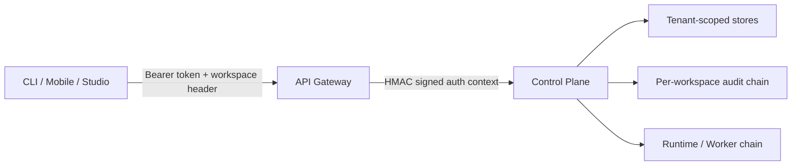

# DATA-02 Tenancy And Governance

Status: `Done`

Delivery sequence:

- `DATA-02A/B`: identity contracts and trusted Gateway-to-Control-Plane chain
- `DATA-02C`: tenant isolation and legacy workspace migration
- `DATA-02D/E`: route-level RBAC and tamper-evident audit
- `DATA-02F`: CLI, Mobile, and Studio workspace productization

## Objective

DATA-02 turns the previous single-user local runtime into a workspace-aware
system without weakening the P0/P1 runtime, evidence, evaluation, trace, or
replay paths.

The implementation guarantees that:

1. client-supplied actor fields are not trusted in signed deployments;
2. a bearer identity can select only one of its configured workspaces;
3. Control Plane accepts identity only from a signed Gateway context;
4. persisted roles, not stale signed permissions, decide authorization;
5. workspace-owned resources cannot be read or mutated across tenants;
6. protected actions and failures produce a verifiable audit chain;
7. CLI, Mobile, and Studio expose the same selected-workspace model.

## Architecture



### Trust boundary

The API Gateway is the only component that converts a client bearer token into
a trusted principal. It resolves:

- principal identity;
- all configured memberships;
- selected workspace;
- role-derived permissions;
- request ID and issue time.

The Gateway serializes that context as base64url JSON and signs the serialized
payload with HMAC-SHA256. The Control Plane independently verifies the
signature and rejects missing, invalid, malformed, or expired contexts when
`MY_MATE_INTERNAL_AUTH_SECRET` is configured.

Client requests cannot make trusted identity headers authoritative. The Gateway
overwrites the internal auth context and signature before forwarding.

### Development boundary

Direct Control Plane development remains possible only when no internal secret
is configured. In that mode the Control Plane creates a development principal
for the requested or `default` workspace. This compatibility mode is explicit
and is not the production trust model.

Configured multi-identity Gateway mode requires an internal secret at startup.
This prevents a deployment from resolving real identities while forwarding an
unsigned context.

## Identity Contracts

Shared contracts live in `@my-mate/shared-types/identity`.

Principal types:

- `user`
- `service`
- `development`

Workspace roles:

- `owner`
- `admin`
- `operator`
- `viewer`

Permissions:

- `workspace.read`
- `workspace.manage_members`
- `registry.manage`
- `mission.create`
- `mission.edit`
- `run.create`
- `run.control`
- `run.evaluate`
- `gate.resolve`
- `audit.read`

Role matrix:

| Permission | Owner | Admin | Operator | Viewer |
| --- | --- | --- | --- | --- |
| Workspace read | Yes | Yes | Yes | Yes |
| Manage members | Yes | Yes | No | No |
| Manage registry/templates | Yes | Yes | No | No |
| Create/edit missions | Yes | Yes | Yes | No |
| Create/control runs | Yes | Yes | Yes | No |
| Evaluate/replay runs | Yes | Yes | Yes | No |
| Resolve human gates | Yes | Yes | Yes | No |
| Read audit | Yes | Yes | Yes | Yes |

`owner` and `admin` currently have the same permission list. `owner` also has a
governance invariant: the last active owner of a workspace cannot be demoted or
revoked.

## Request Flow

1. Client sends `Authorization: Bearer <token>`.
2. Client may send `X-My-Mate-Workspace-Id: <workspace-id>`.
3. Gateway matches the token against configured identities.
4. Gateway rejects an unknown token with `401`.
5. Gateway rejects a workspace outside the identity membership list with `403`.
6. Gateway derives the role permissions and request ID.
7. Gateway signs the complete request auth context.
8. Control Plane verifies signature and the five-minute issue-time window.
9. Control Plane reconciles the signed membership with persistent membership.
10. A revoked membership returns `403`.
11. Control Plane recalculates permissions from the persistent role.
12. Route classification checks the required permission.
13. Tenant context is installed with `AsyncLocalStorage` for the request.
14. Stores filter reads and bind new writes to the trusted workspace and actor.
15. The response outcome is appended to the workspace audit chain when required.

The signed membership is an identity assertion. Persistent membership is the
authorization source of truth after the first reconciliation.

## Tenant Isolation

Request-scoped tenant context uses `AsyncLocalStorage`, so existing store APIs
do not need callers to pass workspace IDs through every runtime layer.

First-class workspace-owned records include:

- sessions and mission projections;
- runs, routes, plans, node runs, events, jobs, leases, and evidence;
- templates;
- agent profiles and skills;
- orchestrator profiles;
- approvals and human-input requests through their parent run;
- artifacts through their parent run;
- messages, attachments, interventions, DAG proposals, and patches through
  their parent session;
- workspaces, memberships, and audit events.

Isolation invariants:

- collection reads return only records from the active workspace;
- direct cross-workspace resource paths return `404`, not a tenant-existence
  disclosure;
- registry records cannot overwrite the same ID owned by another workspace;
- new writes derive `workspace_id` from trusted request context;
- signed actor identity overrides `created_by`, `requested_by`, and equivalent
  client body fields;
- background runtime operations outside a request context retain global access
  so recovery, scheduling, and Worker callbacks continue to function.

## Legacy Migration

`migrateLegacyWorkspaceRecords()` runs during `createApp()` before requests are
served.

The migration:

- assigns missing workspace fields to `default`;
- follows parent Session or Run ownership for dependent records;
- persists the migrated record instead of applying only an in-memory fallback;
- is idempotent and can run on every startup;
- works with both file-json and SQLite through the shared storage backend.

The migration does not infer multiple historical tenants. Existing records are
intentionally consolidated into `default`; operators must perform any later
business-level reassignment explicitly.

## Authorization

Control Plane classifies all `/api` routes centrally before route handlers run.

Important mappings:

- all successful GET requests require `workspace.read`, except audit reads;
- `/api/audit-events` requires `audit.read`;
- workspace/member mutations require `workspace.manage_members`;
- template, registry, orchestrator-profile, and hosting mutations require
  `registry.manage`;
- mission/session/planner mutations require `mission.create` or `mission.edit`;
- run creation requires `run.create`;
- run actions and reruns require `run.control`;
- scorecard, evaluation, replay, and replay-plan actions require `run.evaluate`;
- approvals and human-input submissions require `gate.resolve`.

Authorization happens after trusted identity verification and persistent
membership reconciliation. A role change therefore takes effect without
waiting for a bearer token or signed-context lifetime to expire.

## Audit Protocol

Audit events are append-only JSON records grouped by workspace.

Each event records:

- actor and principal type;
- action and required permission;
- normalized HTTP method and `/api/...` path;
- resource type and resource ID when present;
- allowed, denied, or error outcome;
- HTTP status;
- request ID;
- timestamp and metadata;
- previous event hash and current SHA-256 hash.

The current event hash covers every field except the hash itself. Chain
verification checks:

- each event digest;
- previous-hash references;
- single-root and single-head structure;
- absence of forks;
- full traversal of the supplied workspace chain.

Audit policy:

- all non-GET API outcomes are audited;
- failed GET requests are audited;
- successful GET requests are omitted to keep read noise bounded;
- authentication and authorization denials are audited;
- events are visible only inside their workspace.

`GET /api/audit-events` returns `chain_verified` with the filtered event list.
Verification is performed over the full workspace chain before presentation.

## Public APIs

Identity and governance endpoints:

- `GET /api/auth/me`
- `GET /api/workspaces`
- `POST /api/workspaces`
- `GET /api/workspaces/{workspaceId}/members`
- `PUT /api/workspaces/{workspaceId}/members/{principalId}`
- `GET /api/audit-events`

OpenAPI includes the principal, membership, workspace, member, and audit event
schemas. The generated shared client supports `workspaceId` and sends the
selected-workspace header consistently.

## Configuration

Gateway example:

```powershell
$env:MY_MATE_INTERNAL_AUTH_SECRET = "replace-with-a-long-random-secret"
$env:MY_MATE_API_GATEWAY_IDENTITIES_JSON = @'
[
  {
    "token": "owner-token",
    "principal": {
      "principal_id": "owner-user",
      "display_name": "Workspace Owner",
      "principal_type": "user"
    },
    "memberships": [
      { "workspace_id": "alpha", "workspace_name": "Alpha", "role": "owner" },
      { "workspace_id": "beta", "workspace_name": "Beta", "role": "operator" }
    ]
  }
]
'@
```

Control Plane must receive the same `MY_MATE_INTERNAL_AUTH_SECRET`. The secret
is an internal service credential and must not be exposed to CLI, Mobile, or
Studio.

Legacy `MY_MATE_API_GATEWAY_API_KEY` remains supported as a single development
identity for the `default` workspace.

## Client Behavior

CLI:

- global `--workspace` option;
- `MY_MATE_WORKSPACE_ID` and config-file `workspace_id` support;
- `whoami`, `workspaces`, and `audit` commands;
- bearer and workspace headers on every request.

Mobile:

- bearer token from `EXPO_PUBLIC_MY_MATE_API_KEY`;
- initial workspace from `EXPO_PUBLIC_MY_MATE_WORKSPACE_ID`;
- Account tab with identity, workspace switcher, members, roles, and audit
  chain state;
- API data reload after workspace selection.

Studio:

- bearer token and selected workspace stored in local storage;
- static proxy forwards authorization, workspace, and request ID headers;
- Settings exposes identity, workspace tabs, member roles, and audit events;
- changing token clears a stale workspace selection;
- successful auth refresh clears prior auth errors and reloads all
  workspace-scoped Mission, Run, Template, Registry, Runtime, and Dashboard
  projections;
- workspace switching clears the old projection before loading the new one.

## Verification

Automated coverage includes:

- Gateway token resolution, foreign-workspace rejection, and signed context;
- Control Plane signature, expiry, membership, role, and permission checks;
- workspace isolation for sessions, runs, templates, registry, and dependent
  resources;
- actor spoofing prevention;
- last-active-owner protection;
- legacy migration idempotency;
- audit allowed/denied outcomes and hash-chain verification;
- OpenAPI generation and client workspace headers;
- CLI identity commands;
- Mobile identity headers and Account surface markers;
- Studio security controls and full workspace reload markers.

Browser acceptance used isolated Control Plane, Gateway, and Studio instances.
It verified invalid-token recovery, Alpha/Beta switching, a tenant-specific
template count changing `1 -> 0 -> 1`, member roles, verified audit state,
desktop and `390 x 844` layouts, no document-level horizontal overflow, and no
browser console warnings/errors.

Repository gates:

```bash
npm run check
npm test
npm run build:runtime
git diff --check
```

## Known Boundaries

DATA-02 provides application tenancy and governance, not a complete enterprise
identity platform.

Deferred boundaries include:

- external OIDC/OAuth login and token rotation;
- database row-level security independent of application stores;
- per-workspace encryption keys;
- immutable external audit export or SIEM delivery;
- custom roles and policy authoring;
- registry change approval workflow (`DATA-03`);
- mobile secure credential storage and offline authorization behavior.

These are follow-on production controls. They do not weaken the current
workspace isolation contract, but deployments must not describe the current
static identity JSON as a full identity provider.
