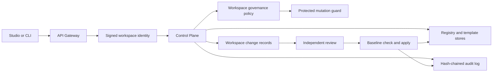
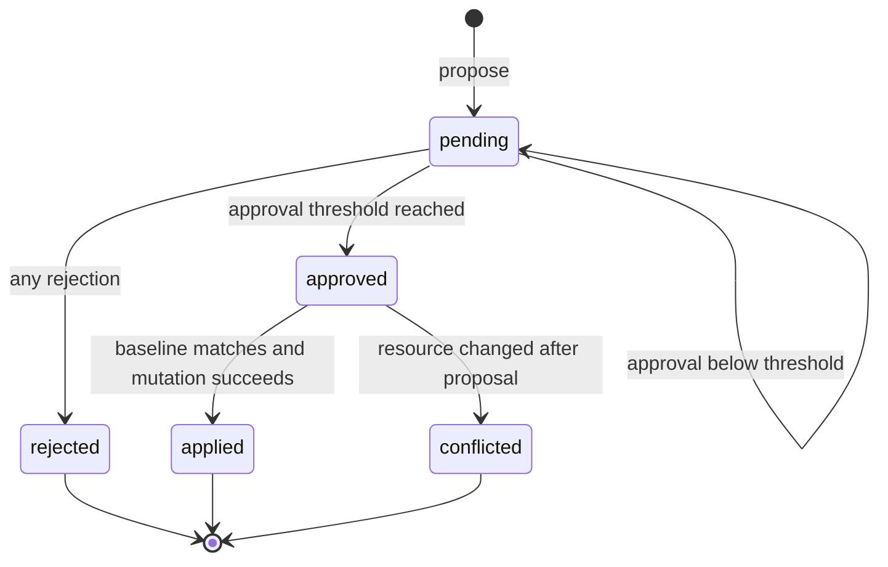

# DATA-03 Registry And Policy Governance

## Purpose

DATA-03 adds an evidence-bearing approval boundary around registry and template
mutations. It extends the DATA-02 workspace identity, RBAC, tenant isolation,
and hash-chained audit foundation without changing existing installations by
default.

The implementation is deliberately opt-in:

- every workspace starts in `advisory` mode
- existing Registry and Template write APIs keep their previous behavior in
  advisory mode
- `enforced` mode rejects protected direct writes and requires a proposal,
  approval, and apply sequence
- approval and apply are separate operations and separate audit events
- self-approval is forbidden by default
- the resource baseline is checked again immediately before apply

## Scope

Protected actions are:

| Action | Resource | Applied mutation |
| --- | --- | --- |
| `agent_profile.upsert` | Agent profile | Create or update a profile |
| `agent_profile.disable` | Agent profile | Disable a profile |
| `skill.upsert` | Skill | Create or update a skill |
| `skill.disable` | Skill | Disable a skill |
| `template.publish` | Template | Publish a draft template |
| `template.archive` | Template | Archive a template |

Draft template edits, template derivation, and other runtime operations are not
protected by DATA-03. The policy record contains `protected_actions` so a
workspace can enable enforcement for a subset of the supported actions.

## Architecture



Responsibilities remain separated:

- API Gateway authenticates bearer identities, selects a workspace, signs the
  internal context, and allowlists governance routes.
- Control Plane recalculates permissions from persistent membership, applies
  policy, owns the change state machine, checks resource drift, mutates the
  Registry or Template store, and emits audit events.
- Shared types and OpenAPI define the transport contract.
- CLI and Studio are clients of the Gateway. Neither client can bypass the
  Control Plane state machine.

## Policy Model

A policy is stored per workspace:

```json
{
  "schema_version": 1,
  "workspace_id": "alpha",
  "mode": "enforced",
  "required_approvals": 1,
  "allow_self_approval": false,
  "protected_actions": [
    "agent_profile.upsert",
    "agent_profile.disable",
    "skill.upsert",
    "skill.disable",
    "template.publish",
    "template.archive"
  ],
  "updated_by": "alpha-owner",
  "created_at": "2026-07-11T00:00:00.000Z",
  "updated_at": "2026-07-11T00:00:00.000Z"
}
```

Rules:

- `mode` is `advisory` or `enforced`
- `required_approvals` is an integer from 1 through 5
- `allow_self_approval` defaults to `false`
- unsupported protected actions are rejected
- the approval requirement and self-approval setting are frozen into each
  proposal, so later policy edits do not silently change an in-flight review

## Permissions

DATA-03 adds `governance.review` to the shared workspace permission set.

| Role | Propose (`registry.manage`) | Review/apply (`governance.review`) |
| --- | --- | --- |
| owner | Yes | Yes |
| admin | Yes | Yes |
| operator | No | No |
| viewer | No | No |

Even when a principal has both permissions, the proposer cannot approve or
reject the same change while `allow_self_approval` is false. A workspace that
enables enforced mode should therefore retain at least two active owner/admin
principals, or intentionally enable self-approval as a weaker policy.

## Change Record And Integrity

Each proposal freezes:

- protected action and resource identity
- reason and payload
- canonical SHA-256 `payload_digest`
- SHA-256 `base_digest` of the current resource, including a null baseline for
  a new resource
- required approval count and self-approval policy
- proposer identity and timestamps

Object keys are sorted recursively before hashing. Undefined fields are
removed and non-finite numbers normalize to null. The resulting digest is
stored as `sha256:<hex>`.

The payload digest proves which proposed payload was reviewed. The base digest
provides optimistic concurrency control: apply recalculates the resource
digest, and a mismatch changes the proposal to `conflicted` instead of
overwriting a concurrent update.

## State Machine



Terminal changes are immutable in this version. A rejected or conflicted
change must be replaced with a new proposal so the reviewed payload and
baseline remain explicit.

## Request Flow

### Advisory Mode

1. Client calls the existing Registry or Template mutation API.
2. Control Plane loads the workspace policy.
3. The guard sees `advisory` mode and allows the existing mutation path.
4. Existing DATA-02 permission and audit behavior remains active.

### Enforced Mode

1. A direct protected mutation returns HTTP `409` with
   `code=governance_approval_required` and the proposal endpoint.
2. A principal with `registry.manage` submits a proposal.
3. Control Plane validates the action, resource, payload, and current resource
   existence where required, then freezes digests and policy values.
4. A different principal with `governance.review` approves or rejects.
5. Once approvals reach the frozen threshold, the change becomes `approved`.
6. A reviewer calls apply as a separate action.
7. Control Plane recalculates `base_digest`.
8. Matching baseline applies the Registry or Template mutation and records the
   result. Mismatch returns HTTP `409` with status `conflicted`.

## API Surface

| Method | Path | Permission | Purpose |
| --- | --- | --- | --- |
| `GET` | `/api/governance/policy` | `governance.review` | Read policy |
| `POST` | `/api/governance/policy` | `governance.review` | Update policy |
| `GET` | `/api/governance/changes` | `governance.review` | List/filter changes |
| `POST` | `/api/governance/changes` | `registry.manage` | Create proposal |
| `GET` | `/api/governance/changes/:changeId` | `governance.review` | Read one change |
| `POST` | `/api/governance/changes/:changeId/approve` | `governance.review` | Record approval |
| `POST` | `/api/governance/changes/:changeId/reject` | `governance.review` | Record rejection |
| `POST` | `/api/governance/changes/:changeId/apply` | `governance.review` | Drift-check and apply |

List filters support `status`, `action`, and a bounded `limit`. Cross-workspace
change reads return `404`, and lists only read the selected workspace.

The API is represented in `openapi/control-plane.openapi.yaml`, generated into
`packages/shared-types/src/generated/control-plane.ts`, re-exported through
`@my-mate/shared-types/control-plane`, and allowlisted by API Gateway.

## CLI Operations

Examples:

```bash
my-mate governance list --status pending
my-mate governance policy
my-mate governance policy --mode enforced --required-approvals 1 --self-approval deny
my-mate governance propose \
  --action agent_profile.upsert \
  --resource-id research-agent \
  --reason "Add reviewed research profile" \
  --payload '{"name":"Research Agent","status":"active"}'
my-mate governance approve <change-id> --comment "Runtime policy reviewed"
my-mate governance reject <change-id> --comment "Tool scope is too broad"
my-mate governance apply <change-id>
```

All commands use normal CLI bearer/workspace configuration and call API
Gateway. `--json` is available for automation.

## Studio Workflow

The Registry workspace includes:

- advisory/enforced policy controls
- required approval count and self-approval setting
- proposal composer with action, resource, reason, and payload
- approval queue with status, proposer, approval count, conflict reason, and
  context-sensitive approve/reject/apply actions

When enforcement covers an existing Studio action, Save/Disable/Publish/Archive
stages the corresponding proposal instead of attempting a direct write. The
user reviews the generated payload and explicitly submits it. Apply refreshes
Registry, Template, and runtime summary projections.

Agent and Skill text inputs synchronize editor state without rerendering the
whole workbench on every input. This prevents focus loss and preserves form
values during both human and automated interaction.

## Persistence And Audit Evidence

Policy and change records use the shared JSON storage backend abstraction:

- file-json paths: `governance-policies` and `governance-changes/<workspace>`
- sqlite mode stores the same logical JSON paths in the shared SQLite backend
- snapshot export/import includes the governance records automatically

Audit events include:

- `governance.policy.updated`
- `governance.change.proposed`
- `governance.change.approved`
- `governance.change.rejected`
- `governance.change.apply`

Denied self-approval and failed drift checks are also recorded. These events
participate in the existing per-workspace SHA-256 audit chain and preserve the
change id, protected action, resource, outcome, status code, and relevant
decision metadata.

## Deployment Sequence

1. Deploy Control Plane, shared contracts, Gateway, CLI, and Studio together.
2. Keep all workspaces in the default `advisory` mode while clients are
   upgraded.
3. Confirm each enforced workspace has enough independent reviewers.
4. Exercise proposal, independent approval, apply, conflict, and audit-chain
   verification in a non-production workspace.
5. Enable `enforced` per workspace through Studio or CLI.
6. Monitor `governance_approval_required`, rejected, and conflicted outcomes.

Rollback does not require deleting evidence. Change the workspace policy back
to `advisory`; existing proposal and audit records remain readable.

## Validation

Focused coverage proves:

- advisory is the default
- enforced mode blocks direct writes
- proposer self-approval is rejected
- operator review is rejected by RBAC
- independent admin approval succeeds
- apply creates the Registry record
- concurrent resource changes produce `conflicted`
- cross-workspace reads return `404`
- governance audit events retain a verified hash chain
- Gateway forwards all governance routes
- CLI commands produce the expected requests and output
- Studio stages protected actions and renders policy/review/apply controls
- desktop and `390 x 844` layouts have no horizontal document overflow

Repository verification commands:

```bash
npm run check
npm test
npm run build:runtime
git diff --check
```

## Known Boundaries

- DATA-03 is optimistic concurrency control, not a distributed transaction
  manager. The baseline check and local store mutation execute in one Control
  Plane process but are not backed by a cross-service lock.
- Rejected and conflicted changes are not reopened; submit a new proposal.
- Notifications, escalation timers, delegated reviewer groups, and scheduled
  policy activation remain future productization work.
- This phase governs Registry and Template lifecycle actions only. Runtime DAG
  interventions continue to use their existing approval and audit mechanisms.
