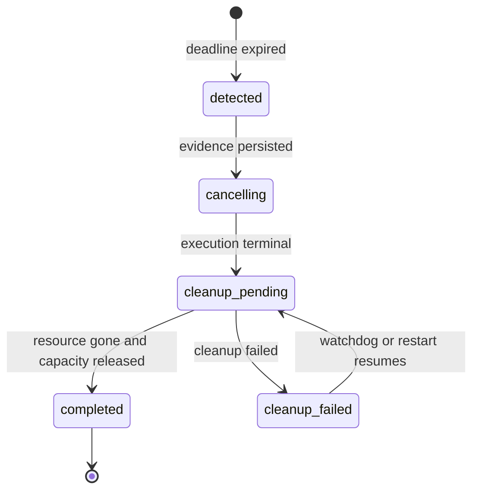
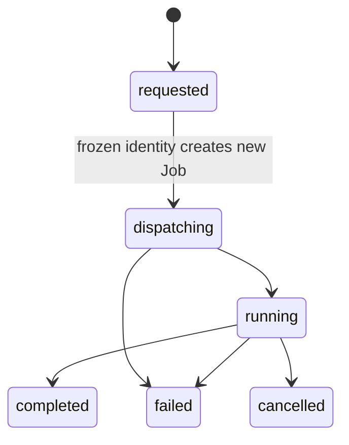

# OC-02 Timeout Compensation And Failure Replay

## Scope

OC-02 completes the recovery loop above OC-01 lease cleanup and Docker
inventory reconciliation:

- `OC-02A`: deadline detection, cancellation, cleanup, capacity gating, and restart continuation.
- `OC-02B`: failed-node execution replay from frozen Job identity.
- `OC-02C`: recovery evidence, Trace integration, API, CLI, and Studio operations.
- `OC-02D`: focused integration, restart-style continuation, Docker recovery, and responsive browser acceptance.

## Execution Semantics

| Operation | Mutates execution | Identity source | Result lineage |
| --- | --- | --- | --- |
| ordinary retry | yes | current effective plan | new attempt and Job in the same Run |
| failure replay | yes | frozen failed source Job | source Job -> Replay -> new Job |
| audit replay | no | immutable events and initial plan | projection verification record |
| linked rerun | yes | frozen effective Run Plan | source Run -> new Run |

Failure replay changes only the attempt and dispatch identity required for a
new execution. Intent, input payload, template/node identity, target, harness,
runtime agent reference, skills, and tools come from the persisted source Job.
`identity_digest` binds that frozen identity. The API returns a bounded frozen
input summary, not the raw Job payload.

## Timeout Compensation



The detector uses the earliest valid deadline from
`accepted_at + timeout_seconds`, `created_at + timeout_seconds`, and
`lease.expires_at`. Records under `runtime-compensations/<run>/` reference the
Run, node, Job, Worker, Lease, cleanup attempts, deadline, capacity result,
optional redispatched Job, and evidence events. Capacity is never restored
before cleanup succeeds or the system proves no Lease existed.

The server watchdog uses `MY_MATE_RECOVERY_SCAN_INTERVAL_MS` (default `1000`).
Startup performs OC-01 Docker reconciliation, continues incomplete
compensation, and resumes a persisted Replay that stopped before dispatch.

## Failure Replay



Replay requires a failed/cancelled node, a failed/cancelled/rejected source
Job, no active Job, no unsettled Lease, and a required `Idempotency-Key`. The
key is bound to one node Replay per Run. Repeating it returns the same record;
reusing it for another node returns `409`. Replay failure does not silently
enter the ordinary automatic retry path.

## Evidence And Operations

Canonical stores:

- `runtime-compensations/<run>/<compensation>.json`
- `execution-replays/<run>/<replay>.json`
- existing Job, Lease, event, evidence, and Trace stores

Lifecycle events use `recovery.timeout_detected`,
`recovery.compensation_started/completed/failed`, and
`recovery.replay_requested/dispatched/completed/failed`. Trace projects these
and Lease cleanup events as control spans. Runtime projection version 2 embeds
the recovery posture and audit records.

API:

- `GET /api/runs/:runId/recovery`
- `POST /api/runs/:runId/recovery/scan`
- `POST /api/runs/:runId/nodes/:nodeRunId/recovery-replays`
- `GET /api/runs/:runId/recovery-replays/:replayId`

Mutations require `run.control`; reads remain workspace-scoped and preserve
cross-workspace `404` behavior.

CLI:

```bash
npm run my-mate -- recovery <run-id>
npm run my-mate -- recovery <run-id> --scan --json
npm run my-mate -- failure-replay <run-id> <node-run-id> --idempotency-key stable-key
```

Studio exposes a Recovery tab in Runtime Graph for posture, cleanup attempts,
source/replay Job lineage, deadline scans, and failed-node Replay.

## Acceptance

Automated coverage verifies expired Job/Lease detection, cleanup failure with
capacity retained, later continuation to completion, frozen identity, distinct
Replay Job lineage, and duplicate-request protection. Existing OC-01 tests and
`npm run runtime-worker:recovery-smoke` covers manager crash, Worker loss,
matched Lease cleanup, orphan container removal, capacity restoration, and
restart reconciliation. `npm run runtime-worker:oc02-smoke` creates a real
Docker container with an expired Lease and verifies deadline compensation,
`docker rm -f`, cleanup audit, and capacity release without model credentials.
