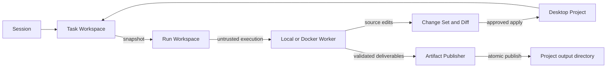

# Project, Task Workspace, and Durable Artifacts

Status: first end-to-end implementation complete

## Ownership model

My Mate now separates long-lived file ownership from execution isolation:

- A **Project** is a user-approved local directory owned by the Desktop host.
- A **Task Workspace** binds one Session to one Project and one output directory.
- A **Run Workspace** is an isolated copy used by a local or Docker Worker.
- A **Change Set** describes proposed source edits from a Run Workspace.
- The **Artifact Publisher** writes validated deliverables into the Task
  Workspace output directory.

Docker is an execution security boundary. It is not the permanent owner of task
files, and the real Project directory is not mounted read-write by default.



## Persistence and privacy

Desktop keeps the real Project path and opaque capability in its private user
data. Control Plane stores a capability digest and Project metadata. Public API
responses expose names, ids, status, and relative output paths, but never the
host absolute path or raw capability.

The product hierarchy is Workspace first:

```text
Desktop Workspace / Project
  -> New task
  -> Task A
  -> Task B
```

The persisted relationship underneath that hierarchy is:

```text
Session -> Task Workspace -> Project -> Workspace Binding
                       \-> output_relative_path
```

The default output directory is `outputs`. A Task Workspace may configure a
different relative directory, but publishing cannot escape that directory.

## Write paths

Source modifications and generated deliverables use different paths:

1. Source edits run against a copied Run Workspace or future Git worktree.
2. The Worker returns a Change Set with a visual diff.
3. Review First and Assisted require the existing human review path; Autopilot
   may apply only when an existing capability and policy permit it.
4. Generated deliverables are validated and atomically published by the trusted
   Artifact Publisher into the configured Project output directory.

The publisher rejects traversal and output-directory symbolic links. It writes
through a temporary file and rename/copy sequence so a partial Worker result is
not exposed as a completed artifact.

## Lifecycle

- Selecting or creating a Project grants Desktop authority only for that path
  and makes it the active Workspace in the left navigation.
- Creating a Task under that Workspace automatically creates its snapshot-read
  Binding and Task Workspace. The user does not configure a directory per Task.
- Opening a Task restores its bound Project when the Desktop still has the
  matching capability.
- Dragging a Task onto another Workspace creates a new snapshot-read Binding,
  revokes the old active Binding, and updates the durable Task Workspace and
  Session metadata. Source-write permission is not carried across implicitly.
- Archiving a Task archives its Task Workspace reference.
- Archiving a Project removes it from active Desktop selection.
- Neither archive operation deletes the physical Project directory or files.
- When no Project remains active, the legacy single-workspace state is removed
  and cannot silently reactivate an archived Project on restart.

## API surface

Public read routes:

```text
GET /api/projects
GET /api/sessions/:sessionId/task-workspace
```

Desktop-authenticated mutation routes:

```text
POST /api/internal/desktop/projects
POST /api/internal/desktop/projects/:projectId/archive
POST /api/internal/desktop/workspace-bindings
```

Session artifact download first resolves the durable published file. Worker
workspace and legacy metadata resolution remain compatibility fallbacks.

## Product behavior

The left navigation owns Workspace selection and creation. Each Workspace row
contains its New task action and Task history. Workspace and Task search share
one field. Historical Tasks without a Project binding appear under Unassigned
tasks and can be dragged into a Workspace. Existing Tasks can be dragged between
Workspace rows; the Desktop validates the target's private capability before
the Control Plane changes the durable association. The Desktop response contains
the updated Project inventory, active Workspace, Binding, and Task Workspace so
Studio can update the left tree without reloading the full Session or scanning
the target directory.

The `+` action opens a global Workspace dialog. It supports selecting an
existing folder or configuring a new folder name, description, and output
directory without expanding or shifting the sidebar tree.

The main navigation uses two tabs. `Task` is the default and contains Tasks,
Inbox, Library, and Settings. `Advanced` contains Mission Workspace, Sessions,
Runtime Dashboard, Subagents, Workflow Editor, Registry, and System Details.

The primary Task workboard does not show Project configuration. It displays only
the active task, outputs, conversation, and execution state. File browsing,
sandbox authorization, Diff, and Apply remain available where they are relevant
to execution and review.
