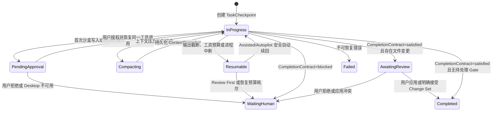

# My Mate 长任务运行时与业务链路

## 1. 目标与边界

My Mate 的长任务由现有 TypeScript Conversation、AgentRun、TaskCheckpoint 和 AgentDag 运行时统一承载，不引入第二套 Agent 或 DAG 执行引擎。

长任务闭环必须同时满足：

1. 写入前有明确授权，沙盒写入与真实目录应用分离。
2. 工具循环持续检查上下文压力，不能只在新一轮对话开始前压缩。
3. 进程中断、输出截断和工具预算边界可以从持久进度续回。
4. 模型说“完成”不等于任务完成，必须通过 Completion Contract 判定。
5. 已完成操作通过幂等键和 Operation Ledger 防止重复执行。
6. 遇到权限、用户输入、真实目录应用或破坏性边界时必须停下来等待用户。

## 2. 核心业务对象

| 业务对象 | 当前持久化载体 | 作用 |
| --- | --- | --- |
| `LongTaskRun` | `SessionRecord` + 最新 `TaskCheckpointRecord` | 表示一个用户任务的长期执行状态、目标和恢复入口 |
| `TurnAttempt` | `AgentRun` + Assistant Message + Provider Evidence | 表示一次模型调用及其工具循环、用量和终止原因 |
| `ContextSnapshot` | `session.metadata.conversation_loop_context_snapshot` | 保存循环内压缩原因、压缩前后估算、摘要和裁剪证据 |
| `ProgressLedger` | `ConversationCodingTransaction.operation_ledger` + `ConversationActionRecord` | 保存已经执行的工具、幂等键、结果和错误，恢复时作为事实来源 |
| `CompletionContract` | `ConversationProviderEvidence.completion_contract` | 判定任务是 `satisfied`、`incomplete` 还是 `blocked` |
| `ApprovalLease` | `WorkspaceBindingRecord` | 表示用户授予某个 Task 的 `snapshot-read` 或 `sandbox-write` 权限 |
| `ChangeSet` | `RuntimeWorkspaceChangeSet` | 沙盒与真实工作区之间的可视化 Diff 和最终应用 Gate |

这些对象共同组成一个长任务，不再依赖单次 HTTP 请求或单个模型响应维持状态。

## 3. 总体状态机



## 4. 一次长任务的完整链路

### 4.1 接收任务

1. Session 保存用户目标、Agent Binding、模型和自主模式。
2. 在调用 Provider 前创建 `TaskCheckpointRecord`，状态为 `in_progress`。
3. 恢复任务时注入 checkpoint 的目标、进度摘要、上下文摘要和下一步动作。
4. 编程任务恢复时，系统提示模型先调用 `workspace_status`，以 Operation Ledger 为准继续未完成部分。

### 4.2 工具执行与写授权

1. 读取工具使用 `snapshot-read` Workspace Binding。
2. 第一次调用 `workspace_apply_operations` 或 `workspace_run_command` 时，如果绑定仍为只读，Action 转为 `pending_approval`。
3. Control Plane 通过 Conversation WebSocket 发出 `workspace.authorize`。
4. Studio 调用 Desktop `workspace.authorize`，显示原生授权弹窗。
5. Desktop 将 Session Binding 升级为 Task 范围的 `sandbox-write`。
6. Control Plane 校验新 Binding 后，继续原工具调用，保留原 `tool_call_id`、Action 和 `idempotency_key`。
7. 后续普通沙盒写入复用该授权，不重复询问。
8. 公网命令、Review First 操作、批量破坏性操作和最终 Change Set 应用仍有独立 Gate。

沙盒写入从不直接修改真实工作目录。所有写、替换、移动、删除和命令都发生在持久 Conversation Coding Workspace 中。

### 4.3 循环内上下文管理

每次 Provider round 前都计算压力：

```text
pressure = max(
  estimated(system + messages + bounded tool definitions),
  provider_reported_input_tokens
)
```

达到 Connection 的压缩阈值后按以下顺序处理：

1. 对同一轮中重复的工具结果去重，保留原 Action 引用。
2. 将大型网页、文件、命令输出替换为结构化摘要，保留状态、错误码、路径、计数和首尾摘录。
3. 如果仍超阈值，将较早的成对 tool call/result 和旧对话折叠为 `LONG_TASK_CONTEXT_SNAPSHOT`。
4. 保留最近历史、目标、失败信息、Operation Ledger 引用和待处理边界。
5. 在 Session 中持久化压缩前后 token 估算、Provider 报告值、裁剪数量和摘要。
6. 通过 `context_compaction` 进度事件让 Studio 显示压缩过程。

新一轮对话开始前仍保留原有滚动摘要。循环内压缩与轮次前摘要是两层机制，前者解决大量工具输出，后者解决长期会话历史。

### 4.4 Completion Contract

Provider round 结束后生成 Completion Contract：

| 状态 | 含义 | 后续动作 |
| --- | --- | --- |
| `satisfied` | Provider 已给出终态回复，没有未解决执行边界 | 无文件变更则完成；有文件变更则进入 Change Set 审阅 |
| `incomplete` | 输出被截断、工具预算结束或回复仍只描述“正在处理” | checkpoint 设为 `resumable`，在预算内自动续回 |
| `blocked` | 缺少授权、Desktop 不可用、存在待审阅事务或其他人工边界 | checkpoint 设为 `waiting_human` |

Completion Contract 同时记录成功和失败 Action ID。Task 完成不再只看 `finish_reason=stop`。

### 4.5 自动续回与恢复

长任务有两类续回：

1. Turn continuation：同一 Provider 调用因 `length` 或说明性回复而继续生成。
2. Task continuation：本轮已经落盘为 checkpoint，系统从新的 TurnAttempt 继续整个任务。

当前自动续回策略：

| 模式 | 读取/普通沙盒工作 | 输出或工具预算边界 | 权限/用户输入/Change Set |
| --- | --- | --- | --- |
| Review First | 不自动续回 | 等待用户 | 等待用户 |
| Assisted | 自动续回 | 自动续回 | 等待用户 |
| Autopilot | 自动续回 | 自动续回 | 高风险和用户 Gate 仍等待用户 |

Control Plane 启动时会将遗留的 `in_progress` checkpoint 转为 `resumable`，然后按同一规则恢复。恢复次数默认最多 3 次。已完成文件操作使用稳定幂等键重放时直接返回历史结果，不再次修改沙盒。

### 4.6 文件任务收口

1. Completion Contract 满足之前，Coding Transaction 保持 `active`，不会提前封存。
2. 任务语义完成后，系统从沙盒生成一个 `RuntimeWorkspaceChangeSet`。
3. Session 和 checkpoint 进入 `waiting_human`，Studio 展示 Diff。
4. 用户确认后，Desktop 重新校验源文件 hash 和沙盒结果 hash。
5. Change Set 以带回滚日志的方式应用到真实目录。
6. 冲突、拒绝或应用失败都有独立终态，不会伪装成完成。

## 5. 防失控边界

当前实现包含：

- Connection 级 `max_tool_rounds` 和 `max_continuation_rounds`。
- TaskCheckpoint 默认最多 8 次自动恢复。
- LongTaskRuntime 默认总预算为 2 小时、12 个 TurnAttempt 和 4,000,000 token；Session 可在受控范围内覆盖。
- 同一工具名和参数连续出现 3 次后强制进入无工具收口。
- Web Search、Web Fetch 和 Browser 有各自的重复调用及单轮预算。
- Provider 单次请求有超时，Workspace Command 最长 900 秒。
- 写入批次最多 200 个操作，单文件和单批次有字节上限。
- 所有沙盒写入使用幂等键和 Operation Ledger。
- Human Gate、真实目录应用和高风险权限不能由模型自行批准。

LongTaskRuntime 已统一记录总 wall time、累计输入/输出 token、TurnAttempt、恢复次数和预算耗尽原因。Provider 未返回可核验价格时费用状态明确为 `unavailable`，不会伪造成本；跨 Agent DAG 总预算仍由 AgentTeam/DAG Policy 独立治理。

输入 token 账本区分 `reported`、`estimated`、`mixed` 和 `unavailable`。Provider 正常上报 usage 时保留原始值；Anthropic-compatible 网关返回 `input_tokens=0` 时，系统使用每个实际发送 round 的本地上下文估算，并分别记录 reported 与 estimated 累计值，避免把未知输入错误记成 0。DNS、`ENOTFOUND` 和 `EAI_AGAIN` 属于可恢复网络中断；HTTP 403 等配置或权限错误保持失败，不会被 partial evidence 重新变成无限续回。

## 6. Studio 可观测性

Studio 应展示以下事实，而不是只显示一个旋转状态：

- 当前阶段：运行、等待授权、压缩上下文、自动续回、等待 Diff、完成或失败。
- Provider/tool round 数量、压缩次数、恢复次数和累计 token。
- 最近成功操作、失败操作和下一步动作。
- 当前 Workspace 权限是只读还是沙盒写。
- Completion Contract 状态和原因。
- Change Set 的文件数、Diff、应用状态和冲突。

当前 Conversation 工具进度已经支持 `pending_approval` 和 `context_compaction`；checkpoint 和 Session Detail 提供恢复与完成证据。

## 7. 真实长任务压测

运行命令：

```powershell
npm run long-task:stress
```

脚本使用 `tmp/long-task-stress/<run-id>` 隔离数据和工作区，不修改仓库文件。场景包括：

1. 只读 Binding 下触发一次真实 Workspace 授权 Gate。
2. 首批 20 个文件写入后保留 `in_progress` checkpoint，模拟 Control Plane 中断。
3. 新 Control Plane 实例恢复任务，并用相同幂等键重放首批操作。
4. 两次读取大型文件，触发循环内工具结果压缩和 Context Snapshot。
5. 再写入 80 个文件，总计 100 个文件。
6. Provider 返回一次长度截断，Assisted 自动创建新的 Task continuation。
7. 调用 `workspace_status` 验证 Operation Ledger。
8. Completion Contract 满足后生成 100 文件 Change Set。
9. 应用 Change Set，并逐项验证真实工作区文件数和最终内容。

2026-07-18 实际结果：

| 指标 | 结果 |
| --- | ---: |
| Workspace 授权 | 1 次 |
| Provider rounds | 8 |
| 循环内压缩 | 3 次 |
| checkpoint 恢复 | 2 次，包含进程恢复和长度续回 |
| Operation Ledger | 3 个唯一写批次 |
| 重复首批写入 | 0，幂等重放命中 |
| Change Set | 100 个文件 |
| 最终应用验证 | 100/100 通过 |
| TurnAttempt | 3（初始执行 + 2 次 checkpoint 续回） |
| 累计 token | 17,720 |
| 总耗时 | 1408 ms，使用确定性压力 Provider |

本压测走真实 Control Plane、Checkpoint、Conversation Tool、Workspace Binding、沙盒文件系统和 Change Set 路径。确定性 Provider 用于稳定制造长上下文、工具轮次和中断条件；外部模型的网络性能应由独立 live acceptance 测试评估。

真实外部 Provider 验收命令：

```powershell
npm run long-task:live
```

脚本复制指定 Connection 和加密凭据到 `tmp/long-task-live/<run-id>`，不会创建真实 Studio Task 或修改工作区。可通过 `MY_MATE_LIVE_PROVIDER_CONNECTION_ID` 选择已验证 Connection。2026-07-18 使用 `openai-default / glm-5.2` 的结果为：1 次真实工具轮、1 次上下文压缩、Completion Contract `satisfied`、4,393 累计 token、16,789 个响应字符，checkpoint 最终为 `completed`。

百万 token 游戏验收：

```powershell
npm run long-task:million-game
```

该验收创建仓库外独立 Workspace，并要求真实模型通过多轮 Workspace 工具生成、读取和验证完整 Canvas 游戏。2026-07-18 的成功游戏 Task 包含 595,684 字符不可丢失当前消息、9 个工具轮和最终收口轮；按运行时 ASCII 估算器计算的保守输入下限为 1,489,210 token，不包含系统提示、工具定义、摘要、工具结果或输出。Provider 未上报有效 input usage，因此报告明确标记为 reconstructed estimated lower bound，不声称为 Provider 计费值。任务发生 2 次压缩，Completion Contract 为 `satisfied`，四文件 Change Set 已应用到独立目录。

## 8. 代码入口

- Workspace 写授权与工具治理：`services/control-plane/src/conversation-tools.ts`
- Conversation 沙盒和 Operation Ledger：`services/control-plane/src/conversation-coding-workspace.ts`
- Provider 工具循环、上下文压缩和 Completion Contract：`services/control-plane/src/conversation-provider.ts`
- TaskCheckpoint 与恢复策略：`services/control-plane/src/task-checkpoint-store.ts`
- Conversation 收口、自动续回和 Change Set 创建：`services/control-plane/src/app.ts`
- WebSocket Desktop Gate：`services/control-plane/src/conversation-websocket.ts`
- Studio Desktop 动作处理：`apps/studio/src/app.js`
- Desktop Workspace 授权：`apps/desktop/electron/main.cjs`
- 长任务压力脚本：`services/control-plane/scripts/long-task-stress.ts`
- 真实 Provider 验收脚本：`services/control-plane/scripts/long-task-live.ts`
- 百万 token 游戏脚本：`services/control-plane/scripts/million-token-game-live.ts`
